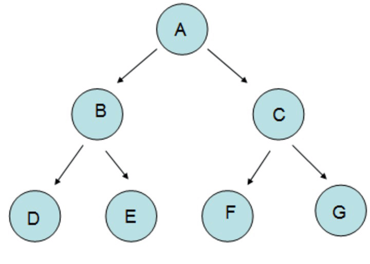
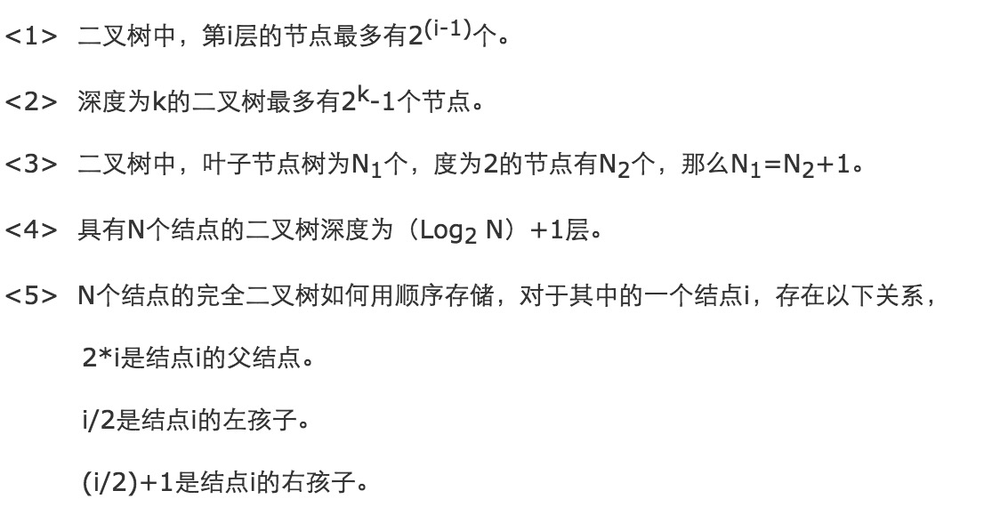
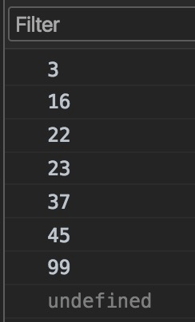
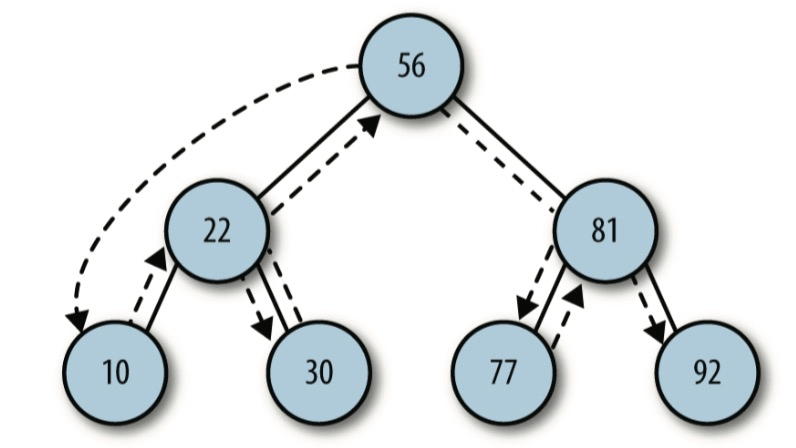
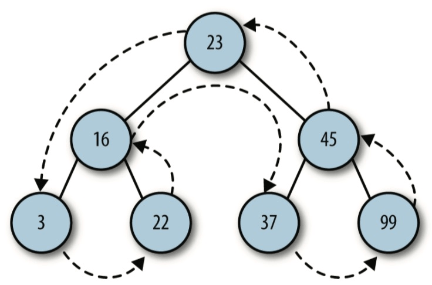
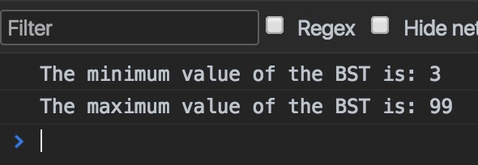
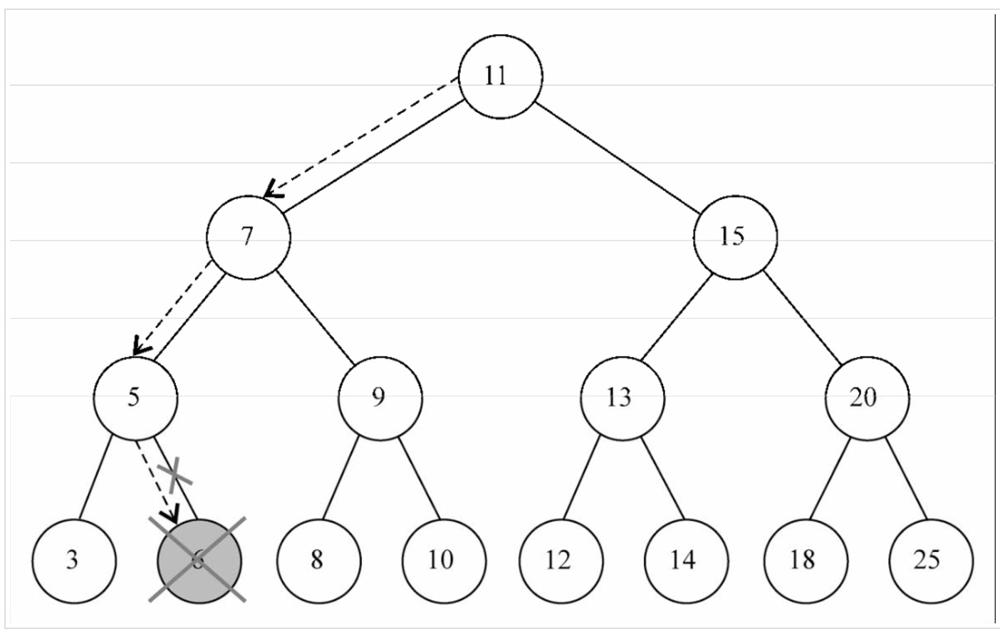
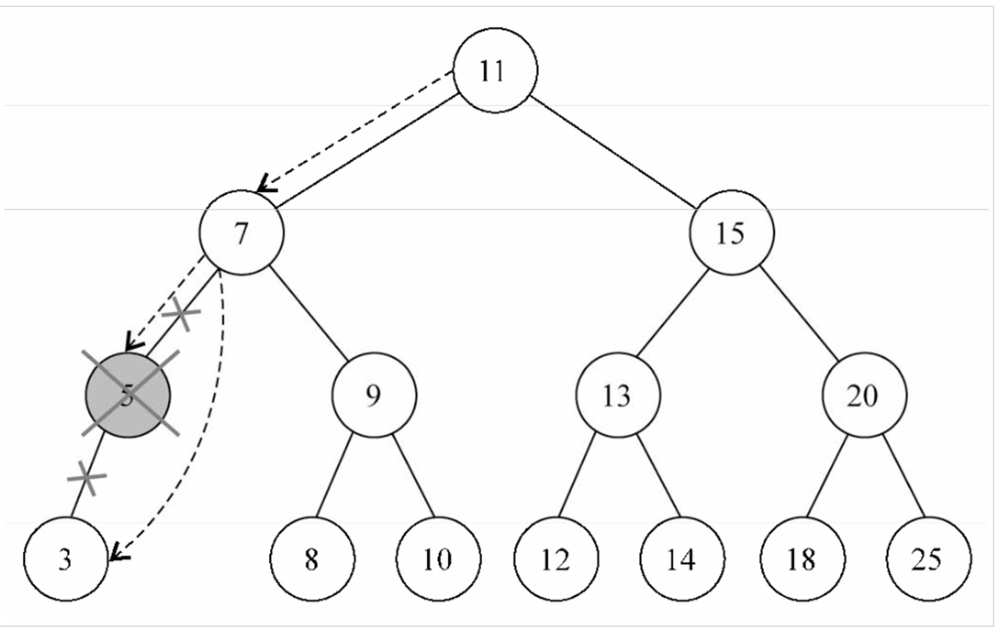
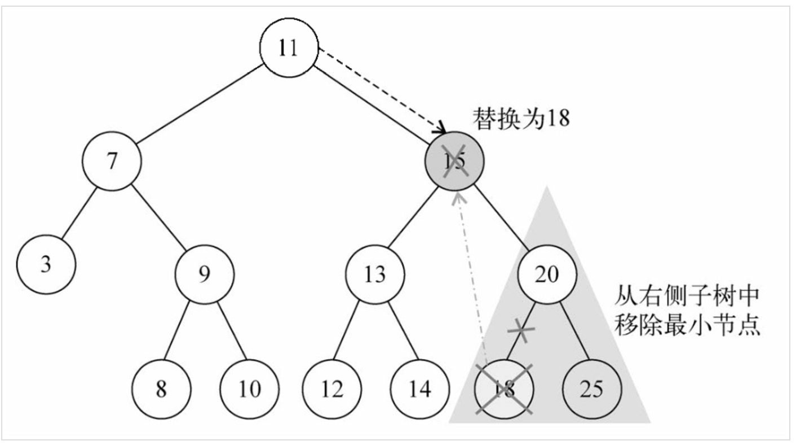

算法和数据结构是程序的基本功，而且语言都是想通的，只要是掌握了一门语言学习其他语言就如同顺水推舟。

从今天开始要把这个系列写下去，虽然网上一搜一大堆，但是我写的这个系列，一方面是分享，一方面是让自己更深入的理解。

什么是树？
-----

- 树是计算机科学中经常用到的一种数据结构;
- 树是一种非线性的数据结构,以分层的方式存储数据;
- 树被用来存储具有层级关系的数据,比如文件系统中的文件;树还被用来存储有序列表;
- 查找、添加、删除元素性能要优于链表及数组;
- 树由一组以边连接的节点组成;

### 树的相关名词

- 父节点，子节点，兄弟节点：这个不用解释都知道吧
- 结点的度：就是分支数
- 树的度: 最大的结点度,最大也是2
- 叶子结点：没有子节点的结点
- 结点的层数：就是树有几层
- 左节点
- 右节点

一棵树最上面的节点称为根节点，如果一个节点下面连接多个节点，那么该节点称为父节点,它下面的节点称为子节点。一个节点可以有0个、1 个或多个子节点。没有任何子节点的节点称为叶子节点。二叉树每个节点的子节点不允许超过两个。

一个父节点的两个节点称为左节点和右节点。如下图的“B”为左节点，“C”为右节点。



### 二叉树的性质 



JS实现二叉树
-------

二叉树中每一个节点都是一个对象，每一个数据节点都有三个指针，分别是指向父母、左孩子和右孩子。定义一个节点对象Node，先定义左右两边的指针:

```js
function Node(data, left, right) {
    this.data = data;      //用于存储数据
    this.left = left;      //左节点
    this.right = right;    //右节点
    this.show = show;      //显示保存在节点中的数据
}
function show() {
    return this.data;
}
```

新建一个类，用于表示二叉查找树BST

```js
function BST() {
    this.root = null;       //用于表示根节点，并初始化为null
    this.insert = insert;   //插入节点的方法
    this.preOrder = preOrder; //先序遍历
    this.inOrder = inOrder; //中序遍历
    this.postOrder = postOrder; //后序遍历
    this.getMin = getMin;
    this.getMax = getMax;
    this.find = find;
    this.remove = remove;         //简单地接受待删除数据
    this.removeNode = removeNode; //删除
}
```

大的框架已经写好了，现在开始插入节点

首先捋一遍思路：

先创建一个对象，将数据传入保存，检查BST是否有根节点，如果没有，就是棵新树，该节点就是根节点，结束；如果树中有根节点了，就要遍历整个树， 给待插入节点找到插入的适当位置，这个时候就需要增加一个变量存储当前节点，一层层的遍历树， 直到找到正确的位置时，跳出循环。

其实这时脑子还是一团浆糊，再细化一下：

1. 判断有无根节点，没有的话，插入到根节点;
2. 如果待插入节点保存的数据小于当前节点，则设新的当前节点为原节点的左节点; 反之，执行第 4 步;
3. 如果当前节点的左节点为null，就将新的节点插入这个位置，退出循环; 反之，继续执行下一次循环;
4. 设新的当前节点为原节点的右节点;
5. 如果当前节点的右节点为null，就将新的节点插入这个位置，退出循环; 反之，继续执行下一次循环;

```js
function insert(data) {
    var n = new Node(data, null, null),
        current,
 	parent;
    if (this.root == null) {
    	this.root = n;
    } else {
	current = this.root;   //根节点指向当前节点
	while(true) {
	    parent = current;  //根节点定义为父节点
	    if (data < current.data) {
		current = current.left;
		if (current == null) {
                    parent.left = n;
		    break;
		}
	    } else {
		current = current.right;
		if (current == null) {
                    parent.right = n;
		    break;
		}
	    }
	}
    }
}
```

现在 BST 类已经初步成型,但是操作上还只能插入节点，还需要有能力遍历BST，这样就可以按照不同的顺序,比如按照数字大小或字母先后,显示节点上的数据。

### 遍历的顺序

先序：根节点==&gt;左子树==&gt;右子树 中序：左子树==&gt;根节点==&gt;右子树 后序：左子树==&gt;右子树==&gt;根节点

**中序遍历的代码：**

```js
function inOrder(node) {
    if (!(node == null)) {
       inOrder(node.left);
       console.log(node.show() + " ");
       inOrder(node.right);
    }
}
```

一个粟子：

```js
var nums = new BST();
    nums.insert(23);
    nums.insert(45);
    nums.insert(16);
    nums.insert(37);
    nums.insert(3);
    nums.insert(99);
    nums.insert(22);
console.log(inOrder(nums.root));
```

结果是：

下图展示了中序的访问路径

**先序遍历的代码：**

```js
function preOrder(node) {
    if (!(node == null)) {
        console.log(node.show() + " ");
        preOrder(node.left);
        preOrder(node.right);
    }
}
```

inOrder() 和 preOrder() 方法的唯一区别,就是 if 语句中代码的顺序。在 inOrder() 方法中,show() 函数像三明治一样夹在两个递归调用之间;在 preOrder() 方法中,show() 函数放在两个递归调用之前。

下图展示了先序的访问路径

**后序遍历postOrder() 方法的实现:**

```js
function postOrder(node) {
    if (!(node == null)) {
       postOrder(node.left);
       console.log(node.right);
       putstr(node.show() + " ");
    }
}
```

下图展示了后序的访问路径

### 二叉树的查找

对 BST 通常有下列三种类型的查找:

- 查找给定值;
- 查找最小值;
- 查找最大值。

这三种查找中，最大值和最小值最简单，最大值都在右子树上，遍历右子树，找到最后一个节点即可，最小值同理。

**最大值：**

```js
function getMax() {
   var current = this.root;
   while (!(current.right == null)) {
      current = current.right;
   }
   return current.data;
}
```

**最小值：**

```js
function getMin() {
    var current = this.root;
    while (!(current.left == null)) {
        current = current.left;
    }
    return current.data;
}
```

上面两个程序直到遍历到最边上的节点，该节点为 current.left 或 current.right == null 时结束

来个例子：

```js
var nums = new BST();
     nums.insert(23);
     nums.insert(45);
     nums.insert(16);
     nums.insert(37);
     nums.insert(3);
     nums.insert(99);
     nums.insert(22);
     var min = nums.getMin();
     print("minimum value: " + min);
     print("\n");
     var max = nums.getMax();
     print("maximum value: " + max);
```

结果：

**再看看查找结定值怎么写**

从根节点开始找，等于根结点就返回，不等的话，再从左子树开始找，找不到再从右子树开始找，直到子树中的值为 null 时结束。

```js
function find(data) {
   var current = this.root;
   while (current != null) {
       if (current.data == data) {
          return current;
       }  else if (data < current.data) {
           current = current.left;
       } else {
           current = current.right;
       }
  }
   return null;
}
```

### 从二叉查找树上删除节点

##### 删除节点分几种情况：

- 删除的节点没有子节点
- 删除的节点只有左子树或只有右子树
- 删除的节点既有左子树又有右子树

##### 思路：

从BST中删除节点,先是判断当前节点是否包含待删除的数据,  
 1) 如果包含，则删除该节点;  
 2) 如果不包含，则比较当前节点上的数据和待删除的数据。  
 ① 如果待删除数据小于当前节点上的数据，则移至当前节点的左子节点继续比较;  
 ② 如果删除数据大于当前节点上的数据，则移至当前节点的右子节点继续比较。

##### 删除

- 如果待删除节点没有节点，那么只需要将从父节点指向它的链接指向null。
- 如果待删除节点只包含一个子节点，那么原本指向它的节点就得做些调整，使其指向它的子节点。
- 如果待删除节点包含两个子节点,正确的做法有两种:  
  1) 查找待删除节点左子树上的最大值  
  2) 查找待删除节点右子树上的最小值

**移除一个叶节点**

第一种情况是该节点没有子节点，要做的就是给这个节点赋予null值来移除它，但是每个节点除了自已包含的节点，还存在一个和父级的关系，所以这里仅赋一个null值是不够的，还需要处理指针。

如下图所示是一个删除叶节点的路径

如果想删除节点6，和当前的根节点进行比较，小于根节点就在左子树上找，反之在右子树上找，6比11小，所以接着左子树第一个节点7和6比较，又小于7接着与7节点的左子树5比较，6大于5接向5节点的右子树查找，最终找到6，这是一个查找的过程，然后再进行删除工作。

**移除有一个左侧或右侧子节点的节点**

移除有一个左侧子节点或右侧子节点的节点。这种情况下，需要跳过这个节点，直接将父节点指向它的指针指向子节点。

如果这个节点没有左侧子节点，也就是说它有一个右侧子节点。 因此我们把对它 的引用改为对它右侧子节点的引用并返回更新后的节点。

如果这个节点没有右侧子节点，也是一样——把对它的引用改为对它左侧子节点的引用并返回更新后的值。

**移除有两个子节点的节点**

大概的分为下面三步：

- 查找的过程就不说了，找到这个要删除的点后，需要找到它右子树中的最小节点
- 这个小最节点替换要删除的节点，同时把右子树中的最小节点删除
- 后向它的父节点返回更新后的引用

理通了上面的思路后，就开始上代码了

定义两个方法：remove() 和 removerNode();

```js
//用于简单地接受待删除数据
function remove(data) {
   root = removeNode(this.root, data);
}
//删除
function removeNode(node, data) {
  if (node == null) {
     return null;
  }
  if (data == node.data) {
    // 没有子节点的节点
    if (node.left == null && node.right == null) {
      return null;
    }
    // 没有左子节点的节点
    if (node.left == null) {
      return node.right;
    }
    // 没有右子节点的节点
    if (node.right == null) {
      return node.left;
    }
    // 有两个子节点的节点
    var tempNode = getSmallest(node.right);
    node.data = tempNode.data;
    node.right = removeNode(node.right, tempNode.data); return node;
  } else if (data < node.data) {
       node.left = removeNode(node.left, data);
       return node;
  } else {
       node.right = removeNode(node.right, data);
       return node;
  }
}
```