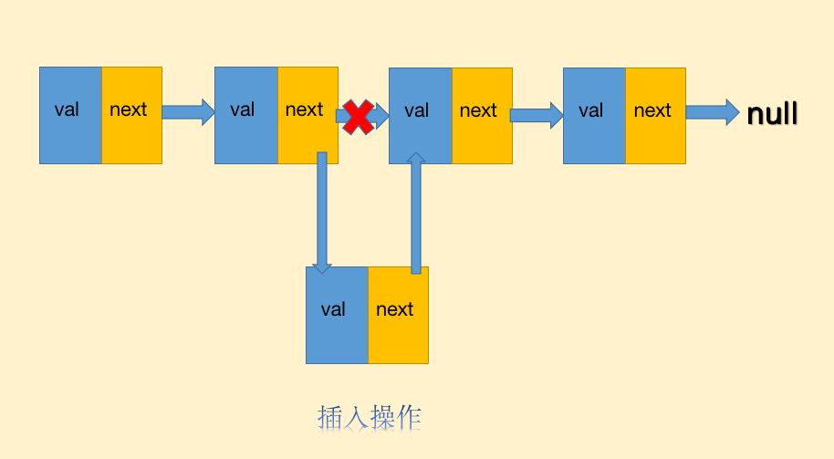
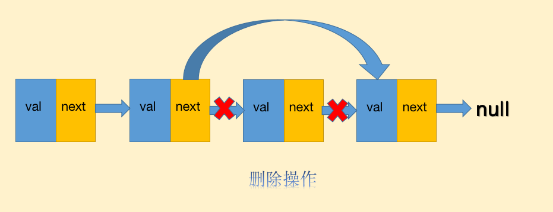
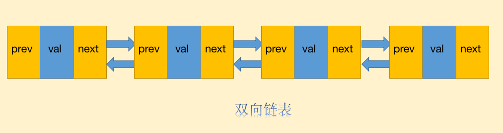
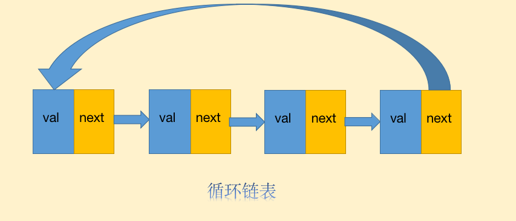

对于不少开发者而言,链表(linked list)这种数据结构既熟悉又陌生,熟悉是因为它确实是非常基础的数据结构,陌生的原因是我们在业务开发中用到它的几率的确不大.

在很多情况下,我们用数组就能很好的完成工作,而且不会产生太多的差异,那么链表存在的意义是什么?链表相比于数组有什么优势或者不足吗?

什么是链表
-----

链表是一种常见的基础数据结构，是一种线性表，但是并不会按线性的顺序存储数据，而是在每一个节点里存到下一个节点的指针(Pointer).

从本质上来讲,链表与数组的确有相似之处,他们的相同点是都是线性数据结构,这与树和图不同,而它们的不同之处在于数组是一块连续的内存,而链表可以不是连续内存,链表的节点与节点之间通过指针来联系.


当然,链表也有不同的形态,主要分为三种:单向链表、双向链表、循环链表.

单向链表
----

单向链表的节点通常由两个部分构成,一个是节点储存的值`val`,另一个就是节点的指针`next`.


链表与数组类似,也可以进行查找、插入、删除、读取等操作,但是由于链表与数组的特性不同,导致不同操作的复杂度也不同.

### 查找性能

单向链表的查找操作通常是这样的:

1. 从头节点进入,开始比对节点的值,如果不同则通过指针进入下一个节点
2. 重复上面的动作,直到找到相同的值,或者节点的指针指向null

链表的查找性能与数组一样,都是时间复杂度为O(n).

### 插入删除性能

链表与数组最大的不同就在于删除、插入的性能优势,由于链表是非连续的内存,所以不用像数组一样在插入、删除操作的时候需要进行大面积的成员位移,比如在a、b节点之间插入一个新节点c,链表只需要:

1. a断开指向b的指针，将指针指向c
2. c节点将指针指向b，完毕

这个插入操作仅仅需要移动一下指针即可，插入、删除的时间复杂度只有O(1).

链表的插入操作如下:


链表的删除操作如下:


### 读取性能

链表相比之下也有劣势，那就是读取操作远不如数组，数组的读取操作之所以高效，是因为它是一块连续内存，数组的读取可以通过寻址公式快速定位，而链表由于非连续内存，所以必须通过指针一个一个节点遍历.

比如,对于一个数组,我们要读取第三个成员,我们仅需要`arr[2]`就能快速获取成员,而链表则需要从头部节点进入,在通过指针进入后续节点才能读取.

### 应用场景

由于双向链表的存在,单向链表的应用场景比较少,因为很多场景双向链表可以更出色地完成.

但是单向链表并非无用武之地,在以下场景中依然会有单向链表的身影:

1. 撤销功能,这种操作最多见于各种文本、图形编辑器中,撤销重做在编辑器场景下属于家常便饭,单向链表由于良好的删除特性在这个场景很适用
2. 实现图、hashMap等一些高级数据结构

双向链表
----

我们上文已经提到,单向链表的应用场景并不多,而真正在生产环境中被广泛运用的正是**双向链表**.

双向链表与单向链表相比有何特殊之处?


我们看到双向链表多了一个新的指针`prev`指向节点的前一个节点,当然由于多了一个指针,所以双向链表要更占内存.

别小看双向链表多了一个前置指针,在很多场景里由于多了这个指针,它的效率更高,也更加实用.

比如编辑器的「undo/redo」操作,双向链表就更加适用,由于拥有前后指针,用户可以自由得进行前后操作,如果这个是一个单向链表,那么用户需要遍历链表这时的时间复杂度是O(n).

> 真正生产级应用中的编辑器采用的数据结构和设计模式更加复杂,比如Word就是采用Piece Table数据结构加上Command queue模式实现「undo/redo」的,不过这是后话了.

循环链表
----

循环链表,顾名思义,他就是将单向链表的尾部指针指向了链表头节点:


循环链表一个应用场景就是操作系统的分时问题,比如有一台计算机,但是有多个用户使用,CPU要处理多个用户的请求很可能会出现抢占资源的情况,这个时候计算机会采取分时策略来保证每个用户的使用体验.

每个用户都可以看成循环链表上的节点,CPU会给每个节点分配一定的处理时间,在一定的处理时间后进入下一个节点,然后无限循环,这样可以保证每个用户的体验,不会出现一个用户抢占CPU而导致其他用户无法响应的情况.

当然,约瑟夫环的问题是单向循环链表的代表性应用,感兴趣的可以深入了解下.

当然如果是双向链表首尾相接呢?这就是双向循环链表.

在Node中有一类场景，没有查询，但是却有大量的插入和删除，这就是Timer模块。 几乎所有的网络I/O请求，都会提供timeout操作控制socket的超时状况，这里就会大量使用到setTimeout，并且这些timeout定时器，绝大部分都是用不到的（数据按时正常响应），那么又会有响应的大量clearTimeout操作，因此node采用了双向循环链表来提高Timer模块的性能,至于其中的细节就不再赘述了.

```
                                        插入！
TimersList <-----> timer1 <-----> timer2 <-----> timer4 <-----> timer3 <-----> ......
                1000ms后执行     1050ms后执行    1100ms后执行    1200ms后执行
```

小结
--

至此,我们对链表这个数据结构有了一定的认知,由于其非连续内存的特性导致链表非常适用于频繁插入、删除的场景，而不见长于读取场景，这跟数组的特性恰好形成互补，所以现在也可以回到题目中的问题了，链表的特性与数组互补，各有所长，而且链表由于指针的存在可以形成环形链表，在特定场景也非常有用，因此链表的存在是很有必要的。

那么，现在有一个非常常见的一个面试向的思考题:

我们平时在用的微信小程序会有最近使用的功能,时间最近的在最上面,按照时间顺序往后排,当用过的小程序大于一定数量后,最不常用的小程序就不会出现了,你会如何设计这个算法?  