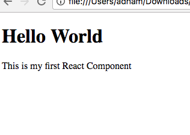

## 前言

React简介
JSX
组件的生命周期
实例化
数据流
事件处理
组件的复合
mixin
DOM操作
动画
性能优化
服务端渲染
周边类库
过滤器
redux
react-redux
redux-thunk
redux-logger
dva
ramda

---

## 3种方式创建React组件

ReactJS是一个很棒的JavaScript库，用于在整个网站中重复使用HTML代码段。它通过使用[JSX](https://facebook.github.io/react/docs/introducing-jsx.html)和[ES6](http://es6-features.org/#Constants)语法将您的常规Javascript代码注入纯HTML代码并通过[Babel](https://babeljs.io/)将其编译为在页面上创建HTML片段的javascript来实现。

**使用CDN导入React和Babel**

您可以通过在HTML的标头标记中包含以下脚本来快速开始使用React：

```html
<!-- React Version 16 -->
<script src="https://unpkg.com/react@16/umd/react.development.js " crossorigin=""></script>
<script src ="https://unpkg.com/react-dom@16/umd/react-dom.development.js "crossorigin></script>
```

此外，您需要包含Babel来编译您的React代码。在其他脚本下面包含以下脚本：
```html
<script src="https://cdnjs.cloudflare.com/ajax/libs/babel-core/5.8.34/browser.js"></script>
```

#### 方法1：使用CreateClass函数

这种创建反应组件的方法从版本16开始丢弃，仅适用于React 版本15或更早版本。 好了，我们来添加React的脚本：
 ```html
<!--  React Version 15  -->
<script crossorigin src="https://cdnjs.cloudflare.com/ajax/libs/react/15.6.1/react.js"></script>
<script crossorigin src ="https://cdnjs.cloudflare.com/ajax/libs/react-dom/15.6.1/react-dom.js"></script>
```

首次创建React时，只有一种方法可以声明组件。 让我们构建一个带有h1 a p等简单标签的HTML。 在您的javascript文件/标记中，声明一个变量并使用**React.createClass()**函数来创建一个组件：
```jsx
const MyComponent = React.createClass ({
   render(){
      return <div>
                <h1> Hello World！</ h1>
                <p>这是我的第一个React组件。</p>
             </ div>
      }
})
```

变量MyComponent现在包含一个可以在网站上的任何位置使用的反应组件。要将该脚本链接到HTML页面，首先必须在页面上具有唯一ID的div元素。
```html
<div id =“react-component”></div>
```

然后在声明react组件变量后的脚本中，使用带有**2个参**数的ReactDOM.render()函数。
```jsx
ReactDOM.render( 
    <MyComponent/>, //第一个是react组件
    document.getElementById('react-component') //第二个是Dom元素
)
```

保存并运行HTML文件后，页面应显示没有错误：


#### 方法2：使用类


在最新版本里已经支持类。您可以创建一个javascript类extends(又名继承)React的Component类并重写上面的方法：
```jsx
class MyComponent extends React.Component{
   render() {
      return <div>
                <h1>Hello World!</h1>
                <p> 这是我的第一个React组件 .</p>
             </div>
      }
}
```

#### 方法3：使用无状态组件

实际上它是一个返回React组件的简单函数（而非变量）。在这里，您将看到一些新的ES6语法，它使javascript代码更短，更易于阅读。  
首先创建一个名为MyComponent 的[**const**](https://developer.mozilla.org/en-US/docs/Web/JavaScript/Reference/Statements/const)并将其设置为等于**function()**,并使用箭头函数**=&gt;**来声明函数逻辑：

```jsx
const MyComponent = () =>{
      return <div>
                <h1> Hello World！</h1>
                <p>这是我的第一个React组件。</p>
             </div>
      }
```

以上就是创建React组件的3种主要方法！ 最好的学习方法是将它们写出来并在浏览器中进行测试，还有阅读官方[文档](https://facebook.github.io/react/docs/hello-world.html)！


## HOC & FAAC  

在接触过React项目后，大多数人都应该已经了解过或则用过了HOC(High-Order-Components)和FaCC(Functions as Child Components)，因为这两个模式在大多数react的开源库里都存在。比如react-router里面的[withRouter](https://github.com/ReactTraining/react-router/blob/master/packages/react-router/modules/withRouter.js#L9) 就是典型的高阶组件，接受一个组件返回另外一个经过增强后的组件。而react-motion中的[Motion](https://github.com/chenglou/react-motion/blob/master/src/Motion.js#L28)就是典型的FaCC的应用。
HOC和FaCC两者做的事也是非常相似的，都是类似设计模式里面的装饰者模式。都是在原有的实例或则单元上进行功能的增强。
当然不只是一些开源库中会使用，在平常的代码编写中，也有很多地方是适用于使用HOC和FaCC去封装一些逻辑。比如数据埋点，新特性的toggle，获取转换数据等。对于增强代码可读性和逻辑复用来说，非常有用的。

### HOC (高阶组件)

高阶函数我们都用过，就是接受一个函数然后返回一个经过封装的函数：

```jsx
const plus = first => second => (first + second)
plus(1)(2) // 3
```

而高阶组件就是高阶函数的概念应用到高阶组件上:

```jsx
const withClassName = ComposedComponent => props => (
   <ComposedComponent {...props} className='demo-class' />
)
const Header = text => (<header>{text}</header>)
const headerWitheClass = withClassName(Header)
```

接受一个组件返回一个经过包装的新组件。在我们经常使用的`withRouter`就是在原有组件`props`上面在加上`localtion`等属性。除了添加props以外高阶组件还能做到：

- 在真正调用组件前后做一些事，比如埋点数据等
- 判断组件是否该render，或则应该render其他的东西，比如出错之后render错误页面
- 传递props并增加新的props
- 不render组件，转而做一些其他的事情，比如渲染一个外部的dom

对于上面的前三点都比较好理解，解释一下第4点。比如你在render了一个页面之后，需要改变一下页面的title.这是单页应用普遍存在的一个需求，通常你可以在具体router库中使用hook去实现。当然也可以通过HOC来实现：

```jsx
const withTitleChange = ComposedComponent => {
  return class extends React.Component {
    componentDidMount () {
      const { title } = this.props
      document.title = title
    }
    render () {
      const props = this.props
      return <ComposedComponent {...props} />
    }
  }
}
```

### FaCC (函数子组件)

同样FaCC也是用于增强原有组件能力的一种模式，其主要功能的实现在于react的[props.children](https://reactjs.org/docs/jsx-in-depth.html#functions-as-children)可以是任何东西，包括函数。我们可以拿上面class的例子用FaCC再实现一遍：

```jsx
const ClassNameWrapper = ({ children }) => children('demo-class')
// 使用
const HeadWithClass = (props) => (
  <ClassNameWrapper>
    {(class) => <header classNmae={class} ></header>}
  </ClassNameWrapper>
)
```

在FaCC中你也可以像HOC一样在生命周期中做很多事对原有的组件进行封装，基本上HOC能做的FaCC也都能做。我所在的项目之前都是大范围的使用HOC，再经过一番讨论后，开始大范围的转变成FaCC。

### 区别

两者都是用来增强原有组件的，具体该使用那种？那种是正确的模式？社区关于这一点也有很多讨论，比如就有人说FaCC是反模式：[Function as Child Components Are an Anti-Pattern](https://americanexpress.io/faccs-are-an-antipattern/)。他给出的理由是children并不语义化，会造成困惑，然后他提出了`Component Injection`的模式，有兴趣的同学可以读一读。

具体从几个方面做一下对比：

1. 组合阶段

组合阶段意思就是HOC，FaCC和要被增强的组件的组合时候。可以很明显发现，FaCC对于前后组件对接依赖信息显示的更多，相对而言更容易理解。而HOC，相互之间如何桥接，你必须得深入到HOC内部读代码才可以知道这个HOC具体干了啥。

```jsx
// HOC example
import View from './View'
const DetailPage = withServerData(withNavigator(View))
```

```jsx
// FaCC example
import View from './View'
const DetailPage = props => (
  <FetchServerData>
    {
      data => (
        <Navigator>
          <View data={data} {...props} />
        </Navigator>
      )
    }
  </FetchServerData>
)
```

如果在上面再增加2个HOC，上面组合的过程就变得十分难看。而FaCC相对而言，如何封装，数据源来自那里，组件接受了那些数据都比较显眼。

>1.性能优化
> 在HOC中我们能接受到宿主的prop，因为props是从HOC往下传递的，所以我们也有完整的生命周期，我们可以使用shouldComponentUpdate优化。而FaCC则不然，无法在其内部做比较props，除非在组合的时候外部在包一个组件才能进行比较props。
>
>2.灵活性
>FaCC 在组合阶段相对HOC更为灵活，他并不规定被增强组件如何使用它传递下去的属性。而HOC基本上在编写完后就定死了。
>另外，FaCC不会再去创建一个新的Component，而HOC会创建一个新的Component然后传递props下去。


## React 设计思想


> 译者序：本文是 React 核心开发者、有 React API 终结者之称的 Sebastian Markbåge 撰写，阐述了他设计 React 的初衷。阅读此文，你能站在更高的高度思考 React 的过去、现在和未来。  
> 原中文: https://github.com/react-guide/react-basic  
> 原英文: https://github.com/reactjs/react-basic

我写此文是想正式地阐述我心中 React 的[心智模型](http://baike.baidu.com/view/2333986.htm)。目的是解释为什么我们会这样设计 React，同时你也可以根据这些论点反推出 React。

不可否认，此文中的部分论据或前提尚存争议，而且部分示例的设计可能存在 bug 或疏忽。这只是正式确定它的最初阶段。如果你有更好的完善它的想法可以随时提交 pull request。本文不会介绍框架细节中的奇技淫巧，相信这样能提纲挈领，让你看清 React 由简单到复杂的设计过程。

React.js 的真实实现中充满了具体问题的解决方案，渐进式的解法，算法优化，历史遗留代码，debug 工具以及其他一些可以让它真的具有高可用性的内容。这些代码可能并不稳定，因为未来浏览器的变化和功能权重的变化随时面临改变。所以具体的代码很难彻底解释清楚。

我偏向于选择一种我能完全 hold 住的简洁的心智模型来作介绍。

### 变换（Transformation）

设计 React 的核心前提是认为 UI 只是把数据通过映射关系变换成另一种形式的数据。同样的输入必会有同样的输出。这恰好就是纯函数。

```js
function NameBox(name) {
  return { fontWeight: 'bold', labelContent: name };
}
```

```
'Sebastian Markbåge' ->
{ fontWeight: 'bold', labelContent: 'Sebastian Markbåge' };
```

### 抽象（Abstraction）

你不可能仅用一个函数就能实现复杂的 UI。重要的是，你需要把 UI 抽象成多个隐藏内部细节，又可复用的函数。通过在一个函数中调用另一个函数来实现复杂的 UI，这就是抽象。

```js
function FancyUserBox(user) {
  return {
    borderStyle: '1px solid blue',
    childContent: [
      'Name: ',
      NameBox(user.firstName + ' ' + user.lastName)
    ]
  };
}
```

```
{ firstName: 'Sebastian', lastName: 'Markbåge' } ->
{
  borderStyle: '1px solid blue',
  childContent: [
    'Name: ',
    { fontWeight: 'bold', labelContent: 'Sebastian Markbåge' }
  ]
};
```

### 组合（Composition）

为了真正达到重用的特性，只重用叶子然后每次都为他们创建一个新的容器是不够的。你还需要可以包含其他抽象的容器再次进行组合。我理解的“组合”就是将两个或者多个不同的抽象合并为一个。

```js
function FancyBox(children) {
  return {
    borderStyle: '1px solid blue',
    children: children
  };
}

function UserBox(user) {
  return FancyBox([
    'Name: ',
    NameBox(user.firstName + ' ' + user.lastName)
  ]);
}
```

### 状态（State）

UI 不单单是对服务器端或业务逻辑状态的复制。实际上还有很多状态是针对具体的渲染目标。举个例子，在一个 text field 中打字。它不一定要复制到其他页面或者你的手机设备。滚动位置这个状态是一个典型的你几乎不会复制到多个渲染目标的。

我们倾向于使用不可变的数据模型。我们把可以改变 state 的函数串联起来作为原点放置在顶层。

```js
function FancyNameBox(user, likes, onClick) {
  return FancyBox([
    'Name: ', NameBox(user.firstName + ' ' + user.lastName),
    'Likes: ', LikeBox(likes),
    LikeButton(onClick)
  ]);
}

// 实现细节

var likes = 0;
function addOneMoreLike() {
  likes++;
  rerender();
}

// 初始化

FancyNameBox(
  { firstName: 'Sebastian', lastName: 'Markbåge' },
  likes,
  addOneMoreLike
);
```

*注意：本例更新状态时会带来副作用（addOneMoreLike 函数中）。我实际的想法是当一个“update”传入时我们返回下一个版本的状态，但那样会比较复杂。此示例待更新*

### Memoization

对于纯函数，使用相同的参数一次次调用未免太浪费资源。我们可以创建一个函数的 memorized 版本，用来追踪最后一个参数和结果。这样如果我们继续使用同样的值，就不需要反复执行它了。

```js
function memoize(fn) {
  var cachedArg;
  var cachedResult;
  return function(arg) {
    if (cachedArg === arg) {
      return cachedResult;
    }
    cachedArg = arg;
    cachedResult = fn(arg);
    return cachedResult;
  };
}

var MemoizedNameBox = memoize(NameBox);

function NameAndAgeBox(user, currentTime) {
  return FancyBox([
    'Name: ',
    MemoizedNameBox(user.firstName + ' ' + user.lastName),
    'Age in milliseconds: ',
    currentTime - user.dateOfBirth
  ]);
}
```

### 列表（Lists）

大部分 UI 都是展示列表数据中不同 item 的列表结构。这是一个天然的层级。

为了管理列表中的每一个 item 的 state ，我们可以创造一个 Map 容纳具体 item 的 state。

```js
function UserList(users, likesPerUser, updateUserLikes) {
  return users.map(user => FancyNameBox(
    user,
    likesPerUser.get(user.id),
    () => updateUserLikes(user.id, likesPerUser.get(user.id) + 1)
  ));
}

var likesPerUser = new Map();
function updateUserLikes(id, likeCount) {
  likesPerUser.set(id, likeCount);
  rerender();
}

UserList(data.users, likesPerUser, updateUserLikes);
```

*注意：现在我们向 FancyNameBox 传了多个不同的参数。这打破了我们的 memoization 因为我们每次只能存储一个值。更多相关内容在下面。*

### 连续性（Continuations）

不幸的是，自从 UI 中有太多的列表，明确的管理就需要大量的重复性样板代码。

我们可以通过推迟一些函数的执行，进而把一些模板移出业务逻辑。比如，使用“柯里化”（JavaScript 中的 [`bind`](https://developer.mozilla.org/en-US/docs/Web/JavaScript/Reference/Global_Objects/Function/bind)）。然后我们可以从核心的函数外面传递 state，这样就没有样板代码了。

下面这样并没有减少样板代码，但至少把它从关键业务逻辑中剥离。

```js
function FancyUserList(users) {
  return FancyBox(
    UserList.bind(null, users)
  );
}

const box = FancyUserList(data.users);
const resolvedChildren = box.children(likesPerUser, updateUserLikes);
const resolvedBox = {
  ...box,
  children: resolvedChildren
};
```

### State Map

之前我们知道可以使用组合避免重复执行相同的东西这样一种重复模式。我们可以把执行和传递 state 逻辑挪动到被复用很多的低层级的函数中去。

```js
function FancyBoxWithState(
  children,
  stateMap,
  updateState
) {
  return FancyBox(
    children.map(child => child.continuation(
      stateMap.get(child.key),
      updateState
    ))
  );
}

function UserList(users) {
  return users.map(user => {
    continuation: FancyNameBox.bind(null, user),
    key: user.id
  });
}

function FancyUserList(users) {
  return FancyBoxWithState.bind(null,
    UserList(users)
  );
}

const continuation = FancyUserList(data.users);
continuation(likesPerUser, updateUserLikes);
```

### Memoization Map

一旦我们想在一个 memoization 列表中 memoize 多个 item 就会变得很困难。因为你需要制定复杂的缓存算法来平衡调用频率和内存占有率。

还好 UI 在同一个位置会相对的稳定。相同的位置一般每次都会接受相同的参数。这样以来，使用一个集合来做 memoization 是一个非常好用的策略。

我们可以用对待 state 同样的方式，在组合的函数中传递一个 memoization 缓存。

```js
function memoize(fn) {
  return function(arg, memoizationCache) {
    if (memoizationCache.arg === arg) {
      return memoizationCache.result;
    }
    const result = fn(arg);
    memoizationCache.arg = arg;
    memoizationCache.result = result;
    return result;
  };
}

function FancyBoxWithState(
  children,
  stateMap,
  updateState,
  memoizationCache
) {
  return FancyBox(
    children.map(child => child.continuation(
      stateMap.get(child.key),
      updateState,
      memoizationCache.get(child.key)
    ))
  );
}

const MemoizedFancyNameBox = memoize(FancyNameBox);
```

### 代数效应（Algebraic Effects）

多层抽象需要共享琐碎数据时，一层层传递数据非常麻烦。如果能有一种方式可以在多层抽象中快捷地传递数据，同时又不需要牵涉到中间层级，那该有多好。React 中我们把它叫做“context”。

有时候数据依赖并不是严格按照抽象树自上而下进行。举个例子，在布局算法中，你需要在实现他们的位置之前了解子节点的大小。

现在，这个例子有一点超纲。我会使用 [代数效应](http://math.andrej.com/eff/) 这个由我发起的 [ECMAScript 新特性提议](https://esdiscuss.org/topic/one-shot-delimited-continuations-with-effect-handlers)。如果你对函数式编程很熟悉，它们 在避免由 monad 强制引入的仪式一样的编码。

```js
function ThemeBorderColorRequest() { }

function FancyBox(children) {
  const color = raise new ThemeBorderColorRequest();
  return {
    borderWidth: '1px',
    borderColor: color,
    children: children
  };
}

function BlueTheme(children) {
  return try {
    children();
  } catch effect ThemeBorderColorRequest -> [, continuation] {
    continuation('blue');
  }
}

function App(data) {
  return BlueTheme(
    FancyUserList.bind(null, data.users)
  );
}
```