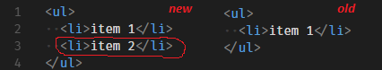
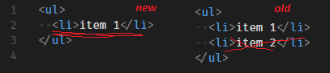
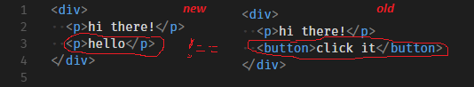
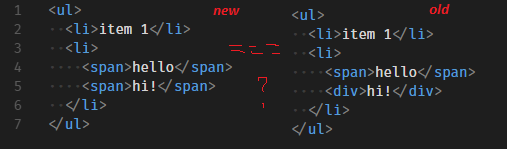
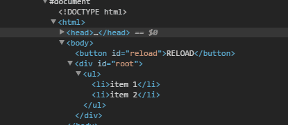

构建自己的Virtual DOM需要了解两件事。您甚至不需要深入了解React的来源。  
或者是任何其他Virtual DOM实现的源代码。  
它们是如此庞大和复杂 – 但实际上Virtual DOM的主要部分可以用少于50行的代码编写。

**50行代码 ！**   
以下是这两个概念：

- 虚拟DOM是真实DOM的任何表示形式
- 当我们在虚拟DOM树中更改某些内容时，我们会得到一个新的虚拟树。算法比较这两个树（旧的和新的），发现差异并且只对真实DOM做出必要的小改动，因此它反映了虚拟.

#### 虚拟DOM（Virtual DOM）

虚拟DOM（VDOM）是一种编程概念，是指虚拟的视图被保存在内存中，并通过诸如ReactDOM这样的库与“真实”的DOM保持同步.  
这个过程被称为[和解](http://react.html.cn/docs/reconciliation.html)

####  React Fiber 

fiber是React 16中新的和解引擎.  
它的主要目的是使虚拟DOM能够进行增量渲染。[了解更多](https://github.com/xxn520/react-fiber-architecture-cn)

#### 影子DOM(Shadow DOM)和虚拟DOM（Virtual DOM) 

它们并不是相同的概念.  
影子DOM是一种浏览器技术，主要被设计用来为Web组件中的变量和CSS提供封装.  
虚拟DOM是由JavaScript库在浏览器API之上实现的一种概念 .

更新：关于在Virtual DOM中设置道具和事件的第二篇文章就在这里

#### 呈现DOM树

 好吧，首先我们需要以某种方式存储我们的DOM树在内存中。我们可以用普通的旧JS对象来做到这一点。假设我们有这棵树：

```html
<ul class="list">
  <li>第1项</li>
  <li>第2项</li>
</ ul>
```

 看起来很简单，是吗？我们怎么能用JS对象来表示呢？

```jsx
{
  type: 'ul',
  props: {'class': 'list'},
  children: [
    {
      type: 'li',
      props: {},
      children: ['item 1']
    },
    {
      type: 'li',
      props: {},
      children: ['item 2']
    }
  ]
}
```

 这里可以注意到：

用像这样的对象来表示DOM元素

```jsx
{ type: '…’, props: { … }, children: [ … ] }
```

- 我们使用普通JS字符串表示DOM文本节点

但是用这种方式写大树很难。所以让我们编写一个辅助函数，这样我们就可以更容易地理解结构了：

```jsx
function h(type，props，... children){
  return {type，props，children};
}
```

现在我们可以像这样编写DOM树：

```jsx
h('ul', {'class': 'list'},
    h('li', {}, 'item 1'),
    h('li', {}, 'item 2'),
);
```

它看起来更干净，是吗？但我们可以走得更远。你听说过JSX，不是吗？是的，我也想在这里。那么它是怎样工作的？

如果你[在这里](https://babeljs.io/docs/plugins/transform-react-jsx/)阅读官方的Babel JSX文档，你会知道，Babel会翻译这段代码：

```jsx
<ul className='list'>
    <li>item 1</li>
    <li>item 2</li>
</ul>
```

像这样：

```jsx
React.createElement（'ul'，{className：'list'}，
  React.createElement（'li'，{}，'item 1'），
  React.createElement（'li'，{}，'item 2'），
);
```

注意任何相似之处？是的，是的..如果我们可以用我们的***h（…）***调用替换那些***React.createElement（…）*** …事实证明我们可以 – 通过使用名为***jsx pragma的*** smth 。我们只需要在源文件的顶部包含类似注释的行：

```jsx
/** @jsx h */
<ul className='list'>
    <li>item 1</li>
    <li>item 2</li>
</ul>
```

好吧，它实际上告诉Babel’嘿，转发jsx而不是***React.createElement***，把***h*** ‘。你可以在那里放任何东西而不是’h`。这将被转化。

那么，总结一下我之前说过的内容，我们将以这样的方式编写DOM：

```jsx
/ ** @jsx h * /
const a =（
    <ul className='list”>
        <li> item 1 </ li>
        <li> item 2 </ li>
    </ ul>
);
```

这将由Babel转换为此代码：

```jsx
const a = (
    h('ul'，{className:'list'}，
        h('li'，{}，'item 1')，
        h('li'，{}，'item 2')，
    );
);
```

当函数`h`执行时，它将返回普通的JS对象 – 我们的虚拟DOM表示：

```jsx
const a = (
    {
        type: 'ul', props: {className: 'list'}, children: [
            {type: 'li', props: {}, children: ['item 1']},
            {type: 'li', props: {}, children: ['item 2']}
        ]
    }
);
```

继续在JSFiddle中尝试（不要忘记将Babel设置为您的语言）：

```jsx
/** @jsx h */
function h(type, props, ...children) {
  return { type, props, children };
}
const a = (
  <ul class="list">
    <li>item 1</li>
    <li>item 2</li>
  </ul>
);
console.log(a);
```

#### 应用我们的DOM表示

好的，现在我们将DOM树表示为普通的JS对象，具有我们自己的结构。这很酷，但我们需要以某种方式从中创建一个真正的DOM。因为我们不能只将我们的表示附加到DOM中。

首先让我们做一些假设并设置术语：

- 我将使用以$ $开头的真实DOM节点（元素，文本节点）编写所有变量 – 所以***$ parent***将是真正的DOM元素
- 虚拟DOM表示将在变量命名***节点中***
- 就像在React中一样，你只能有***一个根节点*** – 所有其他节点都在里面

好吧，说到这里，让我们编写一个函数***createElement（…）***，它将获取一个虚拟DOM节点并返回一个真正的DOM节点。暂时忘掉`props`和`children` – 我们稍后会设置：

```jsx
function createElement(node) {
    if (typeof node === 'string') {
        return document.createTextNode(node);
    }
    return document.createElement(node.type);
}
```

所以，因为我们可以有两个***文本节点*** – 简单的JS字符串和***元素*** – 它们是类型为的JS对象：

```jsx
{ type: '-', props: { - }, children: [ - ] }
```

因此，我们可以在这里传递虚拟文本节点和虚拟元素节点 – 这将起作用。

现在让我们考虑一下孩子 – 每个孩子也可以是文本节点或元素。因此，也可以使用我们的***createElement（…）***函数创建它们。是的，你觉得吗？它感觉递归:)）所以我们可以为每个元素的子元素调用***createElement（…）***，然后将它们***追加***到我们的元素中，如下所示：

```jsx
function createElement(node) {
    if (typeof node === 'string') {
        return document.createTextNode(node);
    }
    const $el = document.createElement(node.type);
    node.children
        .map(createElement)
        .forEach($el.appendChild.bind($el));
    return $el;
}
```

哇，看起来不错。我们暂时搁置节点***道具***。我们稍后会谈论它们。我们不需要它们来理解Virtual DOM的基本概念，但它们会增加更多的复杂性。

现在继续在JSFiddle中尝试：

```jsx
/** @jsx h */
function h(type, props, ...children) {
  return { type, props, children };
}
function createElement(node) {
  if (typeof node === 'string') {
    return document.createTextNode(node);
  }
  const $el = document.createElement(node.type);
  node.children
    .map(createElement)
    .forEach($el.appendChild.bind($el));
  return $el;
}
const a = (
  <ul class="list">
    <li>item 1</li>
    <li>item 2</li>
  </ul>
);
const $root = document.getElementById('root');
$root.appendChild(createElement(a));
```

#### 处理变更

好了，既然我们可以将虚拟DOM变成一个真正的DOM，那么就该考虑区分我们的虚拟树了。所以基本上我们需要编写一个算法，它将比较两个虚拟树 – 旧的和新的 – 并且只对真正的DOM进行必要的更改。

如何区分树木？好吧，我们需要处理下一个案例：

- 有一些地方没有旧节点-因此加入的节点，我们需要***使用appendChild（…）***是


某个地方没有新节点 – 因此删除了节点，我们需要***removeChild（…）***


那个地方有一个不同的节点 – 因此节点发生了变化，我们需要***replaceChild（…）***


节点是相同的 – 所以我们需要更深入和差异的子节点


好的，让我们编写一个名为***updateElement（…）***的函数，它接受三个参数 – ***$ parent***，***newNode***和***oldNode，***其中***$ parent***是我们虚拟节点的真正DOM元素 – 父元素。现在我们将看到如何处理上述所有情况。

#### 没有旧节点

嗯，这里很简单，我甚至不会评论：

```jsx
function updateElement($parent, newNode, oldNode) {
    if (!oldNode) {
        $parent.appendChild(
            createElement(newNode)
        );
    }
}
```

#### 没有新节点

在这里我们遇到了一个问题 – 如果新虚拟树中当前没有节点 – 我们应该从真正的DOM中删除它 – 但是我们应该怎么做呢？是的，我们知道父元素（它被传递给函数），因此我们应该调用***$ parent.removeChild（…）***并在那里传递真正的DOM元素引用。但我们没有那个。好吧，如果我们知道我们的节点在父节点中的位置，我们可以用***$ parent.childNodes \[index\]***来获取它的引用***，***其中***index***是我们节点在父元素中的位置。

好的，我们假设这个***索引***将传递给我们的函数（它确实将被传递 – 你稍后会看到它）。所以我们的代码将是：

```jsx
function updateElement($parent, newNode, oldNode, index = 0) {
    if (!oldNode) {
        $parent.appendChild(
            createElement(newNode)
        );
    } else if (!newNode) {
        $parent.removeChild(
            $parent.childNodes [index]
        );
    }
}
```

#### 节点已更改

首先，我们需要编写一个函数来比较两个节点（旧的和新的）并告诉我们节点是否真的发生了变化。我们应该考虑它可以是元素和文本节点：

```jsx
function changed(node1, node2) {
    return typeof node1 !== typeof node2 ||
        typeof node1 === 'string' && node1 !== node2 ||
        node1.type !== node2.type
}
```

现在，拥有父节点中当前节点的***索引***，我们可以轻松地用新创建的节点替换它：

```jsx
function updateElement($parent, newNode, oldNode, index = 0) {
    if (!oldNode) {
        $parent.appendChild(
            createElement(newNode)
        );
    } else if (!newNode) {
        $parent.removeChild(
            $parent.childNodes[index]
        );
    } else if (changed(newNode, oldNode)) {
        $parent.replaceChild(
            createElement(newNode),
            $parent.childNodes[index]
        );
    }
}
```

#### 差儿

最后，但并非最不重要 – 我们应该遍历两个节点的每个子节点并进行比较 – 实际上为每个节点调用***updateElement（…）***。是的，再次递归。

但在编写代码之前，有一些事情需要考虑：

- 我们应该仅在节点是一个元素（文本节点不能有子节点）时比较子节点
- 现在我们将***当前节点的***引用作为父***节点***传递
- 我们应该逐个比较所有孩子 – 即使在某些时候我们会有’未定义’ – 这没关系 – 我们的功能可以处理
- 最后***索引*** – 它只是`children`数组中子节点的索引

```jsx
function updateElement($parent, newNode, oldNode, index = 0) {
    if (!oldNode) {
        $parent.appendChild(
            createElement(newNode)
        );
    } else if (!newNode) {
        $parent.removeChild(
            $parent.childNodes[index]
        );
    } else if (changed(newNode, oldNode)) {
        $parent.replaceChild(
            createElement(newNode),
            $parent.childNodes[index]
        );
    } else if (newNode.type) {
        const newLength = newNode.children.length;
        const oldLength = oldNode.children.length;
        for (let i = 0; i < newLength || i < oldLength; i++) {
            updateElement(
                $parent.childNodes[index],
                newNode.children[i],
                oldNode.children[i],
                i
            );
        }
    }
}
```

把它们放在一起
=======

是的，就是这样。在那里。我已将所有代码放入JSFiddle中，实现部分实际上花了50个LOC – 正如我所承诺的那样。来吧，玩吧。

```jsx
/** @jsx h */
function h(type, props, ...children) {
    return {type, props, children};
}
function createElement(node) {
    if (typeof node === 'string') {
        return document.createTextNode(node);
    }
    const $el = document.createElement(node.type);
    node.children
        .map(createElement)
        .forEach($el.appendChild.bind($el));
    return $el;
}
function changed(node1, node2) {
    return typeof node1 !== typeof node2 ||
        typeof node1 === 'string' && node1 !== node2 ||
        node1.type !== node2.type
}
function updateElement($parent, newNode, oldNode, index = 0) {
    if (!oldNode) {
        $parent.appendChild(
            createElement(newNode)
        );
    } else if (!newNode) {
        $parent.removeChild(
            $parent.childNodes[index]
        );
    } else if (changed(newNode, oldNode)) {
        $parent.replaceChild(
            createElement(newNode),
            $parent.childNodes[index]
        );
    } else if (newNode.type) {
        const newLength = newNode.children.length;
        const oldLength = oldNode.children.length;
        for (let i = 0; i < newLength || i < oldLength; i++) {
            updateElement(
                $parent.childNodes[index],
                newNode.children[i],
                oldNode.children[i],
                i
            );
        }
    }
}
// ---------------------------------------------------------------------
const a = (
    <ul>
        <li>item 1</li>
        <li>item 2</li>
    </ul>
);
const b = (
    <ul>
        <li>item 1</li>
        <li>hello!</li>
    </ul>
);
const $root = document.getElementById('root');
const $reload = document.getElementById('reload');
updateElement($root, a);
$reload.addEventListener('click', () => {
    updateElement($root, b, a);
});
```

打开开发人员工具并观察按“重新加载”按钮时应用的更改。



#### 结论

恭喜！我们已经做到了。我们编写了Virtual DOM实现。它有效。我希望，在阅读本文之后，您了解了Virtual DOM应该如何工作以及React如何工作的基本概念。

但是有一些事情没有在这里突出显示（我将在以后的文章中尝试介绍它们）：

- 设置元素属性（props）并对它们进行区分/更新
- 处理事件 – 向元素添加事件侦听器
- 使我们的虚拟DOM与组件一起工作，例如React
- 获取对真实DOM节点的引用
- 将Virtual DOM与直接改变真实DOM的库一起使用 – 比如jQuery及其插件
- 甚至更多……

PS
==

如果代码或文章中有任何错误，或者我可以对此代码进行任何优化 – 请随意在评论中表达:)）抱歉我的英文:)

更新：关于在Virtual DOM中设置Props和Event的第二篇文章就在这里