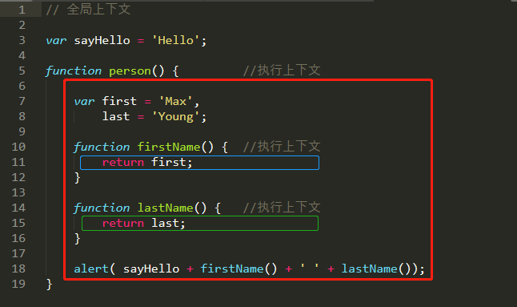
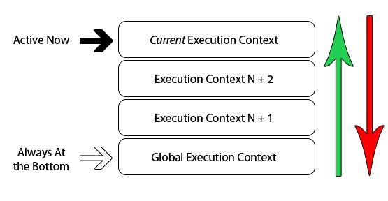

在本文中，我将深入研究JavaScript的最基本部分之一`Execution Context`。 在这篇文章的最后，您应该对解释器正在尝试做的事情，为什么在声明它们之前可以使用某些函数/变量以及如何真正确定其值有更清楚的了解。

什么是执行上下文？
---------

当代码在JavaScript中运行时，执行代码的环境非常重要，并且其评估结果如下：

- **全局代码** –首次执行**代码**的默认环境。
- **功能代码** –每当执行流进入功能主体时。
- **Eval代码** –在内部评估功能内部执行的文本。

您可以在线阅读很多参考资料，`scope`为了使本文更容易理解，本文将其`execution context`视为正在评估当前代码的环境/范围。看到，包括一个例子`global`和`function / local`上下文中计算的代码。



这里没有什么特别的事情，我们有1个`global context`以紫色边框`function contexts`表示，而3个以绿色，蓝色和橙色边框表示。只能是1 `global context`，可以从程序中的任何其他上下文中进行访问。

您可以具有任意数量的`function contexts`，并且每个函数调用都会创建一个新的上下文，这将创建一个私有作用域，在该作用域中，不能从当前函数作用域之外直接访问该函数内部声明的任何内容。在上面的示例中，函数可以访问在其当前上下文外部声明的变量，但是外部上下文无法访问在内部声明的变量/函数。为什么会这样？此代码的评估方式如何？

执行上下文堆栈
-------

浏览器中的JavaScript解释器实现为单个线程。实际上，这意味着在浏览器中一次只能发生一件事情，而其他动作或事件则在队列中排队`Execution Stack`。下图是单线程堆栈的抽象视图：


 
众所周知，当浏览器首次加载脚本时，`global execution context`默认情况下会输入。如果在全局代码中调用一个函数，则程序的顺序流将进入被调用的函数，创建一个新函数`execution context`并将该上下文推到的顶部`execution stack`。

如果在此当前函数中调用另一个函数，则会发生相同的情况。代码的执行流进入内部函数，该内部函数创建一个新函数，该新函数`execution context`被推到现有堆栈的顶部。浏览器将始终执行`execution context`位于堆栈顶部的当前值，并且一旦函数完成了current的执行`execution context`，它将从堆栈顶部弹出，将控制权返回到当前堆栈中的上下文。下面的示例显示了递归函数和程序的`execution stack`：

```js
(function foo(i) {
    if (i === 3) {
        return;
    }
    else {
        foo(++i);
    }
}(0));
```


该代码简单地自我调用3次，将i的值加1。每次`foo`调用该函数时，都会创建一个新的执行上下文。一旦上下文完成执行，它将弹出堆栈，然后控制权返回到其下面的上下文，直到`global context`再次到达为止。

 **关于以下几点，有5点要记住`execution stack`**：

- 单线程。
- 同步执行。
- 1 个Global环境。
- 无限函数环境。
- 每个函数调用都会创建一个新的`execution context`，甚至是对自身的调用。

执行上下文详细
-------

现在我们知道每次调用一个函数`execution context`都会创建一个新函数。但是，在JavaScript解释器内部，对的每次调用`execution context`都有两个阶段：

1. **创建阶段** \[在调用函数时，但在其中执行任何代码之前\]：
  - 创建范围链。
  - 创建变量，函数和参数。
  - 确定的值`"this"`。
2. **激活/代码执行阶段**：
  - 分配值，对函数的引用以及解释/执行代码。

可以在`execution context`概念上将每个对象表示为具有3个属性的对象：

```js
executionContextObj = {
    'scopeChain': { /* variableObject + all parent execution context's variableObject */ },
    'variableObject': { /* function arguments / parameters, inner variable and function declarations */ },
    'this': {}
}
```

### 激活/可变对象\[AO / VO\]

这`executionContextObj`是在调用函数时但*在*实际函数执行*之前*创建的。这称为阶段1 `Creation Stage`。在这里，解释器`executionContextObj`通过扫描函数以查找传入的参数或参数，局部函数声明和局部变量声明来创建。扫描的结果成为`variableObject`中的`executionContextObj`。

**这是解释器如何评估代码的伪概述**：

1. 找到一些代码来调用一个函数。
2. 在执行`function`代码之前，创建`execution context`。
3. 进入创建阶段：
  - 初始化`Scope Chain`。
  - 创建`variable object`：
      - 创建`arguments object`，检查上下文中的参数，初始化名称和值并创建参考副本。
      - 扫描上下文中的函数声明：
            - 对于找到的每个函数，在中创建一个属性，该属性与`variable object`函数的确切名称相同，该属性在内存中具有指向该函数的引用指针。
            - 如果函数名称已经存在，则引用指针值将被覆盖。
      - 扫描上下文中的变量声明：
            - 对于找到的每个变量声明，`variable object`在变量名称中创建一个属性，并将该值初始化为undefined。
            - 如果中已经存在变量名称`variable object`，则什么也不做，然后继续扫描。
  - 确定`"this"`上下文中的值。
4. 激活/代码执行阶段：
  - 在上下文中运行/解释功能代码，并在代码逐行执行时分配变量值。

让我们看一个例子：

```js
function foo(i) {
    var a = 'hello';
    var b = function privateB() {
    };
    function c() {
    }
}
foo(22);
```

 调用时`foo(22)`，`creation stage`外观如下：

```js
fooExecutionContext = {
    scopeChain: { ... },
    variableObject: {
        arguments: {
            0: 22,
            length: 1
        },
        i: 22,
        c: pointer to function c()
        a: undefined,
        b: undefined
    },
    this: { ... }
}
```

 如您所见，用于`creation stage`定义属性名称的句柄，除了形式参数/参数之外，没有为它们分配值。一旦`creation stage`完成，执行流程将进入函数，并且`execution stage`在函数完成执行后，激活/代码如下所示：

```js
fooExecutionContext = {
    scopeChain: { ... },
    variableObject: {
        arguments: {
            0: 22,
            length: 1
        },
        i: 22,
        c: pointer to function c()
        a: 'hello',
        b: pointer to function privateB()
    },
    this: { ... }
}
```

### Hoisting

你可以找到许多资源网上定义的术语`hoisting`在JavaScript中，解释变量和函数声明*悬挂*其功能范围的顶部。但是，没有人详细解释这种情况的发生原因，并且借助有关解释器如何创建的新知识`activation object`，很容易理解为什么。请看以下代码示例：

```js
(function() {
    console.log(typeof foo); // function pointer
    console.log(typeof bar); // undefined
    var foo = 'hello',
        bar = function() {
            return 'world';
        };
    function foo() {
        return 'hello';
    }
}());
```

我们现在可以回答的问题是：

- **为什么在声明之前可以访问foo？**
  - 如果遵循`creation stage`，我们知道变量已在之前创建`activation / code execution stage`。因此，随着功能流程开始执行，`foo`已经在中定义了`activation object`。
- **Foo被声明两次，为什么foo被显示为** `function` **not** `undefined` **或** `string`**？**
  - 即使`foo`已声明两次，我们也从中知道`creation stage`函数是在`activation object`before变量上创建的，并且如果属性名称已经存在于上`activation object`，我们只是绕过了decleration。
  - 因此，`function foo()`首先在上创建了对的引用`activation object`，当解释器到达时`var foo`，我们已经看到属性名称`foo`存在，因此代码不执行任何操作并继续进行。
- **为什么是bar** `undefined`**？**
  - `bar`实际上是具有功能分配的变量，我们知道这些变量是在中创建的，`creation stage`但它们的初始值为`undefined`。

摘要
--

希望到目前为止，您已经对JavaScript解释器如何评估您的代码有了很好的了解。了解执行上下文和堆栈可以使您知道为什么代码评估为最初没有期望的不同值的原因。

您是否认为了解解释器的内部工作方式是否对您的JavaScript知识有过多的开销或必要？了解执行上下文阶段是否可以帮助您编写更好的JavaScript？

原文: http://davidshariff.com/blog/what-is-the-execution-context-in-javascript/