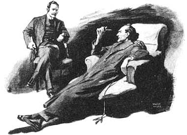
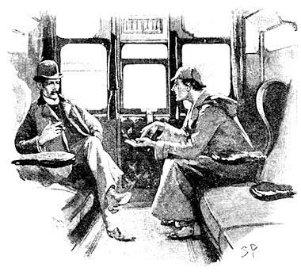
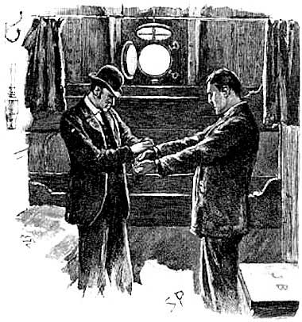

良好的研究和好的侦探工作之间惊人的相似。在这篇文章中，我们来仔细看看用户体验研究员可以从侦探所使用的调查方法中学到什么。通过这些经典的侦探故事，我们得出一个重要结论：如果你想要成为更好的研究员，你应该学会如何像侦探一样思考。良好的研究和好的侦探工作之间惊人的相似。其实也不奇怪，因为这两个学科都会涉及调查、都会去寻找一系列的证据，并且目的都是获得解决方案。**但是更深一层来说，所需要的知识、技能、经验、方法和技巧也有许多共同点。**事实上，毫不夸张的说，侦察就是研究、 研究而研究也就是侦察。那么从这些优秀的福尔摩斯侦探故事中又能学习到什么可以用于用户体验研究呢？？

他包括以下五个步骤：

1. 了解要解决的问题
2. 大胆假设，解释真相
3. 忽略最不可能的假设，得出方案

我们可以互换角色来看一下这些侦察步骤可以教我们如何做良好的用户体验研究。

####   

#### 第 1 步，了解要解决的问题

“我从不猜测，这是一个非常破坏逻辑的推理的坏习惯。”——《四签名》（1890）你最感兴趣的是问题还是答案？毫无疑问答案是问题。即使问很简单的问题也能促进思考，一旦你得到了答案你就会失去兴趣。大部分的用户研究员和福尔摩斯被这些富有挑战性的问题所激起的好奇心，反而要比答案本身来的更令其振奋。所以令人费解的是在设计领域把重点放在解决方案和答案上。方案就是目标，但他们不应该本末倒置的从解决方案入手。像现在很多团队一样，太早关注于设计方案，就是离你想要解决的问题点越来越远。福尔摩斯反对直接寻求解决方案，他说：“在了解这些事实之前就妄加推测，那是最大的错误，有人会无形中把事实扭曲来适应理论而不是用理论来适应事实。”他总是从每宗案件的谜团中着手。可能是一封信，有时候是报纸上的一则新闻，但是通常从敲门就已经预示着谜团的开始。客户会告诉福尔摩斯离奇的故事，他会通过观察客户来得到一些重要的线索。他还带承受他相当的知识，对该主题，回顾之前的情况下，并且发现了他能够做的关于可能的主角。运用大量的知识，或者回忆之前的案例来找出相关的重要人物。福尔摩斯从猜测或假设上。对福尔摩斯而言，每一个新案件都是独一无二的并且有可靠的证据。这些给了调查最初的重点和方向。下面是一些我们能从福尔摩斯的调查中学习到的运用于用户体验研究中的方法：

- 不要开始就着眼于解决方案
- 创建明确的研究问题 （把研究问题写下来）。
- 在有疑问之前不要做任何研究。
- 在有疑问之前不要做任何猜测。
- 找出你所知道的。
- 档案搜索——首先阅读之前的研究报告。
- 会见小组成员和相关者。
- 使用表格方式来收集背景信息。
- 绝不妄下猜测。

#### 第 2 步，收集事实

“材料 ！材料 ！材料 ！”他不耐烦地嚷道，”没有粘土，我做不出砖头。”——铜山毛榉案 (1892)。虽然福尔摩斯善于质疑，但他知道，如果要人们准确的说出所见所闻，或者所了解所想的，本身就是一个不可靠的方法。观点不是事实，而且推测也不能成为证据。因而，他收集事实的首要方法就是仔细观察：“华生，你是知道我的方法的，它是建立在对细微事物的观察之上。”一些案件现场看似无关紧要和细枝末节之处，对福尔摩斯而言却是非常重要的。细微的线索往往可以得出一个重要推断。观察对于创新是至关重要的，也是用户体验研究人员的一项重要方法。在研究领域使用时，它可以帮助我们了解人们真实情况是怎么工作以及做了什么 （而不是他们所说的他们是如何做的）。它还有助于我们着眼于他们的工作细节，详细的工作流程，这些往往是用户自己所做不到的。这是确定用户潜在需求的关键 — — 因为他们不知道什么是可能的事情，所以无法清楚地表述。不要担心你所捕捉到的信息的相关性，这是观察时的一个好习惯。不要基于事先预期、 假设而过滤一些信息来进行资料收集。在此阶段不要去判断或衡量这些信息。不要试图解释这些你所观察到的信息，也不要试图把这些信息去对应到某个方案或者计划，所有这些以后再去考虑。回顾其中一个成功案例，福尔摩斯是这么提醒华生的：” 你还记得，我们经常以脑中空白的状态的去接手一个案件，我们没有成型的理论，只是简单的去观察，这往往是我们的优势所在。”现在你只需要确保你抓住了每个细节。因为你总是可以在之后去剔除一些无用的信息，但你可能无法重访案发之地来收集的那些你错过的信息。您可能不需要像侦探一样穿乔装打扮，或带着放大镜趴在地上，但是这里有一些是可以借鉴福尔摩斯的，从而改进我们信息搜集和观察的技能：

- 观察用户实际是怎么工作的——而不是为了演示。
- 请记住这些参与者都是专家，你是”新手”。
- 专注于最典型的任务；最繁忙的时节；最有代表性的日期；以及最重要的事件。
- 找出之前做过的事情并且根据任务流来观察其行为。
- 寻找那些棘手的、拖延的和让人受挫的地方。
- 跟随他们无论他们去哪儿。
- 找出他们想要什么。
- 获取文物、 样品、 表格和文档的复印件和照片。
- 用图表来表现你所需要设计的区域。
- 列出用户使用的工具。
- 注意用户的动态和交互行为。
- 对于同时发生的事情需要警觉。
- 记录下任何你在现场看到的异常情况。
- 问问自己，是否有缺失遗漏。
- 以最详细仔细的程度去观察——看看人们所触碰的以及所看到的。
- 特别留意事件和行为的顺序和时间。
- 特别留意那些细节。

#### 第 3 步，大胆假设，解释真相

“恰恰相反，华生，你什么都能看出来。你只是没有就看到的东西展开推论。你对展开推论太缺乏信息了。”——《冒险史》中蓝宝石案 (1892)。福尔摩斯提出的这些解释事实的假设是根据了大量的知识和经验：**通常，在事情发生的过程中，我会发现一些细微的线索，我脑海中所浮现的这些相似的案例会指引我做出一些假设**。*他的知识是很深刻的，但它也是非常精细的。他了解很多化学、 脚印、 各种有毒花 （但不是园艺） 和血迹，并且他是有成就的小提琴家。通过可以分辨140 种不同的雪茄、烟斗、香烟、烟草之间专业的差别就可以看出他的精细的关注点。同样，我们必须运用我们对人类行为、技术进步、市场趋势和我们商务目标的了解来帮助我们确定研究中收集的最符合的模型和解决方案。

我们的假设，现在能帮助我们识别人们工作的不同方式。当我们对做过的事情和将来可能会做的事情进行比较的时候，这么做的重要性就体现出来了。为了我们创新和设计团队发现这些不同，在我们工作的进程中必须充分的回答关于用户、任务、使用环境的问题。（谁？做什么？在什么情况下？）我们的模型、角色、场景和故事应包括：

- 主要的目标
- 心理模型的建立
- 使用的工具
- 工作环境。
- 术语，用来描述做什么

#### 第 4 步，忽略最不可能的假设，得出解决方案

“我记得有一句古老的格言说，当你排除了不可能的情况后，其余的情况，尽管多么不可能，却必定是真实的。”——《冒险史》中绿玉皇冠案侦探面临着许多的嫌疑犯，此时，如果我们做好我们的工作，就将会面对很多产品想法和方案。在这个步骤中，我们开始忽略最不可能成功的方案。侦探经常这么问，”想法是否符合事实？”我们用户研究员则是问，”方案是否符合我们所观察到的数据？”我们开始放弃一些不适合的方案，那些不能完全说明我们观察到的一切；并且我们应用奥卡姆剃刀和放弃那些只符合特例数据的方案。我们进行测试。福尔摩斯，记得吗，他是一个科学学者。他进行了实验。忽略那些可能的假设是存在高风险的。证据只会支持一个相对更令人信服的方案。在侦查工作中寻找大量证据虽然不是什么新鲜的理论，但是却能很好运用于用户体验研究中。我不是指统计，我是指可靠和有效的数据以及预测数据的能力。最重要的是不带有偏见的证据。在这方面，并不是所有数据都可以被采用。这是一个有用的层次结构：

- 强有力的证据：精心设计，并且独立进行可用性测试；请认真负责的测试者来进行试用版本的测试；存档的调查以及荟萃分析之类的研究报告。
- 次有力的证据： 内部的可用性测试；公司内部员工的可用性测试；使用该产品的可用性专家的反馈。
- 较弱的证据：基于从焦点小组和调查得来的意见；朋友和同事的意见反馈；管理者的意见；事实证据。

随着我们进入实际设计阶段，测试应在迭代的过程中和团队一起配合设计出成功的原型。**James Dyson****非常出色的测试了****5,127****原型才成功的完成了双旋流器无袋真空吸尘器。**您可能不需要这么多的迭代的原型，但你也不能期望一步而成。  
那么直觉有什么作用呢？难道它没有任何用吗？不是。但是，首先，我们应该消除这种误解。**直觉不是胡乱猜测**。我们只有对我们熟悉的事情才会产生直觉，这就是直觉的本质。对事情的熟悉意味着经验丰富。所以直觉是有作用，它会给我们的设计决策产生影响。当我们读到首席执行官史蒂夫 · 乔布斯用直觉判断来处理事情的时候，他也是像福尔摩斯一样，依靠他丰富的经验来处理类似情况。他知道什么行得通，什么行不通。但我们这里指的并不是 ‘莽撞’、 ‘凭感觉’、 ‘瞎猜’的这种直觉。坦率地说，如果你只是打算瞎猜测，但是这这个阶段来说已经没有任何意义了，你还不如在一开始就瞎猜。

#### 第 5 步，执行方案

“搞清一个案子的最好办法，就是把案子的细节讲给另一个人听”。——《银色马》(1892)每当福尔摩斯破一个案子，他会向委托人、华生和警察描述犯罪经过，接着警察逮捕罪犯，案件侦破。福尔摩斯的工作就完成了，他又积累了一次经验，然后开始下一个案件的侦破。

下面是一些可以确保设计团队对你的调查结果采取行动的建议：

- 进行为期一天的设计工作坊，把用户体验研究的方案传递给设计团队。
- 向团队陈述具体和可操作的设计建议。
- 为了帮助用户体验研究应该要给研究员一定的权利
- 在战术和战略上创建和提出一系列明确步骤。
- 安排测试新设计版本不断迭代。
- 进行用户体验和以用户为中心的设计方法的培训。
- 主导设计会议而不只是参加。

**像侦探一样思考**我们在探索怎样才能像侦探一样思考。我们做到了吗？可能我只是想像侦探一样有敏锐的洞察力— — 比如发现墙上的海报的标记。我们都崇拜福尔摩斯，这是一个不争的事实，他性格鲜明，不像其他侦探会受到干扰——但是他是虚构的人物。所以为了了解真实的生活，我决定和真实生活中的侦探聊聊。我联系了一个老校友，他最近在西约克郡刑事侦查局工作，我问他：”如果只给新研究员一条建议，你想说什么？”他毫不犹豫地回答：”永远，永远，永远不要依据假设行动，找出事实后再针对他们采取行动”。福尔摩斯已经做到最好了，他讲事实讲证据、不猜测不假设。这就是如何像一个侦探一样思考。
