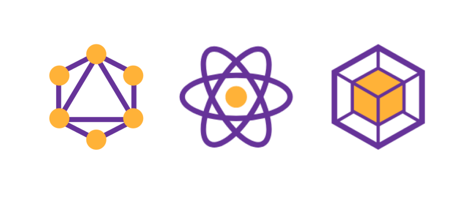

# Why?  为什么我们需要Gatsby?

Gatsby 是一个静态网站生成器，例如Hugo，Jekyll等。那有什么特别之处呢？
Gatsby可用于构建静态网站，这些网站是渐进式Web应用程序，遵循最新的Web标准，并经过优化以实现高性能。它利用了最新和流行的技术，包括ReactJS，Webpack，GraphQL，现代的ES6 + JavaScript和CSS。

- ✔️ 基于 React 的免费、开源框架
- ✔️ 构建运行速度极快的网站
- ✔️ Gatsby SSG会利用代码/数据拆分，预加载，预缓存，图像优化和各种性能增强的功能
- ✔️ 构建时渲染服务器端
- ✔️ 推送到仓库时，会自动部署
- ✔️ 超丰富的生态资源




GraphQL + React + Webpack = 💘

#### 快速开始

##### 使用 Gatsby CLI
```shell
# 安装 Gatsby CLI.
npm install -g gatsby-cli

#创建站点
gatsby new gatsby-site

# 切换目录
cd gatsby-site

#启动
gatsby develop
```
Gatsby 将会启动一个热更新的开发环境，你可以通过 localhost:8000 访问.


##### 其他常用命令

```bash
# 构建生产版本
gatsby build

#本地启动生产版
gatsby serve

#查看 CLI 指令文档
gatsby --help
#对于特殊的指令，运行 gatsby COMMAND_NAME --help ，例如 gatsby new --help
```


---

##### Gatsby 项目结构

```markup
|-- /.cache
|-- /plugins
|-- /public
|-- /src
    |-- /pages
    |-- /templates
    |-- html.js
|-- /static
|-- gatsby-config.js
|-- gatsby-node.js
|-- gatsby-ssr.js
|-- gatsby-browser.js
```

-   gatsby-config.js <small>- 网站配置选项，并为项目标题，说明，插件等提供元数据</small>
-   gatsby-node.js <small>- 实施 Node.js API，以自定义和扩展影响构建过程的默认设置</small>
-   gatsby-browser.js <small>- 使用浏览器 API 自定义和扩展影响浏览器的默认设置</small>
-   gatsby-ssr.js <small>- 使用服务器端渲染 API 自定义影响服务器端渲染的默认设置</small>


---

##### 使用CSS

1. 全局CSS文件

创建一个全局CSS文件
```css:title=src&nbsp/&nbspstyles&nbsp/&nbspglobal.css
html {
  background-color: lavenderblush;
}
p {
  color: maroon;
}
```
全局CSS文件导入文件中gatsby-browser.js
```js:title=gatsby-browser.js
import "./src/styles/global.css"
```

>  还可以利用require('./src/styles/global.css')来将全局CSS文件导入文件中gatsby-config.js


2. 组件中用全局CSS

创建两个文件：layout.css和layout.js
```css:title=/src&nbsp/components/layout.css
body {
  background: red;
}
```

layout.js以导入CSS文件
```js:title=/src/components/layout.js
import React from "react"
import "./layout.css"

export default ({ children }) => <div>{children}</div>
```

3. 使用Sass/Scss

```bash
npm install --save sass gatsby-plugin-sass
```

把插件添加到 gatsby-config.js
```bash:title=gatsby-config.js
plugins: [`gatsby-plugin-sass`],
```

修改gatsby-browser.js
```js:title=gatsby-browser.js
{
    resolve: `gatsby-plugin-sass`,
    options: {
        implementation: require('sass')
    },
}
```

在 .sass 或 .scss 文件中编写样式表, 并引入到 JavaScript 文件

```css:title=styles.scss
$font-stack: Helvetica, sans-serif;
$primary-color: #333;
body {
  font: 100% $font-stack;
  color: $primary-color;
}
```

```bash:title=gatsby-config.js
import "./styles.scss"
import "./styles.sass"
```
---

#### 处理数据源
Gatsby处理数据是基于插件.   插件从数据源中提取数据, 也可以自行处理数据源。<br>
`gatsby-source-filesystem` -> 从文件系统中提取数据 <br>
`gatsby-source-wordpress`  -> 从 WordPress API 提取数据

#### 向 GraphQL 添加数据
...


```jsx
import React from 'react';
const AboutPage = () => (
    <main>
        <h1>About the Author</h1>
        <p>Welcome to my Gatsby site.</p>
    </main>
);
export default AboutPage;
```


#### 参考链接
- [Adding cover images to your Gatsby blog](https://tjaddison.com/blog/2019/10/adding-cover-images-to-your-gatsby-blog/)
- [Building advanced blog system in Gatsby and React](https://danilowoz.com/blog/advanced-blog-system-in-gatsby)
- [syntax-highlighting-prismjs-gatsby](https://stephencharlesweiss.com/syntax-highlighting-prismjs-gatsby/)