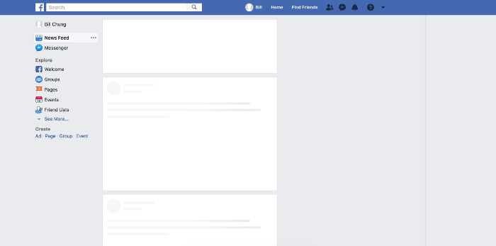
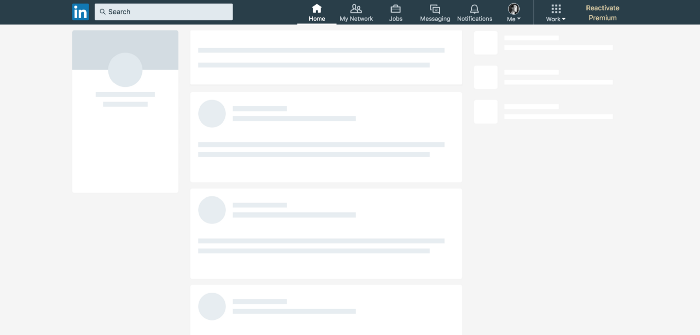
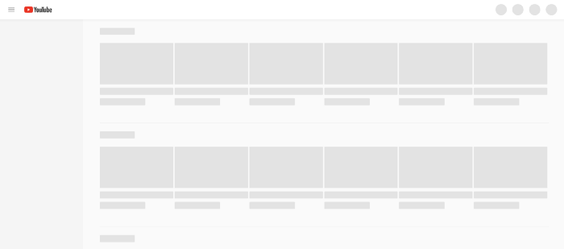

在网上设计加载状态经常被忽视或被视为事后的想法。性能不仅仅是开发人员的责任，建立一个与慢速连接一起工作的体验也可能是一项设计挑战。
虽然开发人员需要关注缩小和缓存等问题，但设计人员必须考虑UI在处于“加载”或“离线”状态时的外观和行为方式。

### ＃速度的错觉

随着我们对移动体验的期望发生变化，我们对性能的理解也在变化。人们期望网络应用程序感觉像本机应用程序一样快速响应，无论其当前的网络覆盖范围如何。

[感知性能](https://en.wikipedia.org/wiki/Perceived_performance)衡量某事物对用户的**感受**速度。这个想法是用户更耐心，并且如果他们知道正在发生什么并且能够在实际存在之前预测内容，他们会认为系统更快。这是关于管理期望和让用户了解情报的重点。

对于Web应用程序，此概念可能包括显示文本，图像或其他内容元素的“模型” – 称为**骨架屏幕** 💀。您可以在Facebook，Google，Slack和其他公司使用的野外发现这些：

### ＃一个例子

假设您正在构建一个Web应用程序。这是一种旅行建议类型的东西，人们可以分享他们的旅行和推荐地点，所以你的主要内容可能看起来像这样：







每当有人从服务器请求新内容时，您可以立即开始显示骨架，同时在后台加载数据。内容准备就绪后，只需将骨架换成实际卡即可。这可以使用普通的JavaScript或使用像React这样的库来完成。

现在您可以使用图像来显示骨架，但这会引入额外的请求和数据开销。我们已经在这里加载了东西，所以等待另一个图像首先加载并不是一个好主意。此外，它没有响应，如果我们决定调整一些内容卡的样式，我们将不得不复制骨架图像的更改，以便它们再次匹配。😒嗯。

更好的解决方案是使用CSS创建整个事物。没有额外的请求，最小的开销，甚至没有任何额外的标记。我们可以通过以下方式构建它，以便以后更轻松地更改设计。

### ＃在CSS中绘制骷髅

首先，我们需要绘制构成卡片骨架的基本形状。我们可以通过向属性添加不同的渐变来实现此目的`background-image`。默认情况下，线性渐变从上到下运行，具有不同的颜色停止过渡。如果我们只定义一个颜色停止并使其余颜色保持透明，我们可以绘制形状。

请记住，多个背景图像在此处堆叠在一起，因此顺序非常重要。最后一个渐变定义将在后面，第一个定义在前面。

```css
.skeleton {
  background-repeat: no-repeat;
  background-image:
    /* layer 2: avatar */
    /* white circle with 16px radius */
    radial-gradient(circle 16px, white 99%, transparent 0),
    /* layer 1: title */
    /* white rectangle with 40px height */
    linear-gradient(white 40px, transparent 0),
    /* layer 0: card bg */
    /* gray rectangle that covers whole element */
    linear-gradient(gray 100%, transparent 0);
}
```

这些形状可以伸展以填充整个空间，就像常规的块级元素一样。如果我们想要改变它，我们必须为它们定义显式维度。值对`background-size`设置每个图层的宽度和高度，保持我们使用的相同顺序`background-image`：

```css
.skeleton {
  background-size:
    32px 32px,  /* avatar */
    200px 40px, /* title */
    100% 100%;  /* card bg */
}
```

最后一步是将元素放在卡上。这就像`position:absolute`，表示`left`和`top`属性的值一样。例如，我们可以为头像和标题模拟24px的填充，以匹配真实内容卡的外观。

```css
.skeleton {
  background-position:
    24px 24px,  /* avatar */
    24px 200px, /* title */
    0 0;        /* card bg */
}
```

### ＃使用自定义属性将其分解

这在一个简单的例子中效果很好 – 但是如果我们想要构建一些更复杂的东西，那么CSS会很快变得混乱并且很难阅读。如果另一位开发人员提交了该代码，他们就不知道所有这些魔术数字来自哪里。保持它肯定会很糟糕。

值得庆幸的是，我们现在可以使用[自定义CSS属性](https://www.smashingmagazine.com/2017/04/start-using-css-custom-properties/)以更加简洁，开发人员友好的方式编写骨架样式 – 甚至可以考虑不同值之间的关系：

```css
.skeleton {
  /*
    define as separate properties
  */
  --card-height: 340px;
  --card-padding:24px;
  --card-skeleton: linear-gradient(gray var(--card-height), transparent 0);
  --title-height: 32px;
  --title-width: 200px;
  --title-position: var(--card-padding) 180px;
  --title-skeleton: linear-gradient(white var(--title-height), transparent 0);
  --avatar-size: 32px;
  --avatar-position: var(--card-padding) var(--card-padding);
  --avatar-skeleton: radial-gradient(
    circle calc(var(--avatar-size) / 2),
    white 99%,
    transparent 0
  );
  /*
    now we can break the background up
    into individual shapes
  */
  background-image:
    var(--avatar-skeleton),
    var(--title-skeleton),
    var(--card-skeleton);
  background-size:
    var(--avatar-size),
    var(--title-width) var(--title-height),
    100% 100%;
  background-position:
    var(--avatar-position),
    var(--title-position),
    0 0;
}
```

这不仅更具可读性，而且以后更容易更改某些值。此外，我们可以使用一些变量（想`--avatar-size`，`--card-padding`等）来定义样式的实际卡始终与镂空版本保持同步。

现在添加媒体查询以调整不同断点处的骨架部分也非常简单：

```css
@media screen and (min-width: 47em) {
  :root {
    --card-padding: 32px;
    --card-height: 360px;
  }
}
```

[浏览器](http://caniuse.com/#feat=css-variables)对自定义属性的[支持](http://caniuse.com/#feat=css-variables)很好，但不是100％。基本上，所有现代浏览器都有支持，IE / Edge有点晚了。对于此特定用例，使用Sass变量添加回退很容易。

### ＃添加动画

为了使这更好，我们可以为我们的骨骼设置动画，使其看起来更像是一个加载指示器。我们需要做的就是在顶层放置一个新的渐变，然后用它来设置其位置的动画`@keyframes`。

以下是成品骨架卡外观的完整示例：

```html
<div class="card"></div>
```

```css
/*
 * Variables
 */
:root {
  --card-padding: 24px;
  --card-height: 340px;
  --card-skeleton: linear-gradient(lightgrey var(--card-height), transparent 0);
  --avatar-size: 32px;
  --avatar-position: var(--card-padding) var(--card-padding);
  --avatar-skeleton: radial-gradient(circle 16px at center, white 99%, transparent 0
  );
  --title-height: 32px;
  --title-width: 200px;
  --title-position: var(--card-padding) 180px;
  --title-skeleton: linear-gradient(white var(--title-height), transparent 0);
  --desc-line-height: 16px;
  --desc-line-skeleton: linear-gradient(white var(--desc-line-height), transparent 0);
  --desc-line-1-width:230px;
  --desc-line-1-position: var(--card-padding) 242px;
  --desc-line-2-width:180px;
  --desc-line-2-position: var(--card-padding) 265px;
  --footer-height: 40px;
  --footer-position: 0 calc(var(--card-height) - var(--footer-height));
  --footer-skeleton: linear-gradient(white var(--footer-height), transparent 0);
  --blur-width: 200px;
  --blur-size: var(--blur-width) calc(var(--card-height) - var(--footer-height));
}
/*
 * Card Skeleton for Loading
 */
.card {
  width: 280px; //demo
  height: var(--card-height);
  &:empty::after {
    content:"";
    display:block;
    width: 100%;
    height: 100%;
    border-radius:6px;
    box-shadow: 0 10px 45px rgba(0,0,0, .1);
    background-image:
      linear-gradient(
        90deg,
        rgba(lightgrey, 0) 0,
        rgba(lightgrey, .8) 50%,
        rgba(lightgrey, 0) 100%
      ),                          //animation blur
      var(--title-skeleton),      //title
      var(--desc-line-skeleton),  //desc1
      var(--desc-line-skeleton),  //desc2
      var(--avatar-skeleton),     //avatar
      var(--footer-skeleton),     //footer bar
      var(--card-skeleton)        //card
    ;
    background-size:
      var(--blur-size),
      var(--title-width) var(--title-height),
      var(--desc-line-1-width) var(--desc-line-height),
      var(--desc-line-2-width) var(--desc-line-height),
      var(--avatar-size) var(--avatar-size),
      100% var(--footer-height),
      100% 100%
    ;
    background-position:
      -150% 0,                      //animation
      var(--title-position),        //title
      var(--desc-line-1-position),  //desc1
      var(--desc-line-2-position),  //desc2
      var(--avatar-position),       //avatar
      var(--footer-position),       //footer bar
      0 0                           //card
    ;
    background-repeat: no-repeat;
    animation: loading 1.5s infinite;
  }
}
@keyframes loading {
  to {
    background-position:
      350% 0,
      var(--title-position),
      var(--desc-line-1-position),
      var(--desc-line-2-position),
      var(--avatar-position),
      var(--footer-position),
      0 0
    ;
  }
}
/*
 * Demo Stuff
 */
body {
  min-height:100vh;
  background-color:#FFF;
  display:flex;
  justify-content:center;
  align-items:center;
}
```