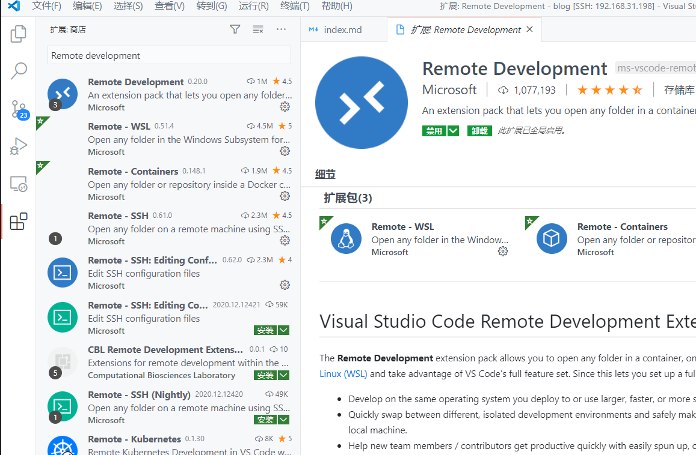
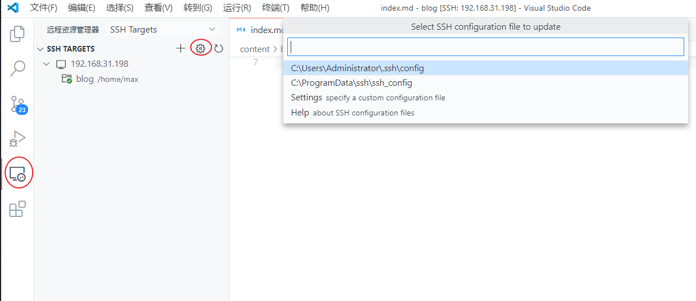
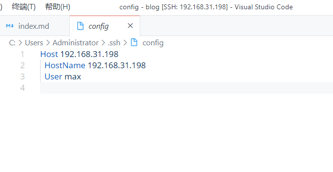
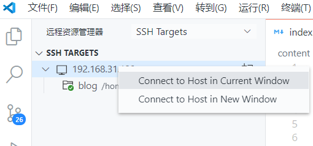

#### 密码登录方式

- 搜索并安装插件

```bash
Remote Development
```




- 配置服务器

进入远程调试栏-》点击配置图标-》进入配置文件夹进行配置




根据自己对应信息进行填写即可

```bash
Host Ubuntu
  # 这里填入要在远程主机上登录的用户名
  User max
  # 这里填入远程主机 IP
  HostName 192.168.x.xxx
  # 这里填入远程主机 ssh 端口
  Port 22
  # 这里填你私钥的路径
  IdentityFile c:\Users\max\.ssh\id_rsa
  # 当需要跳板机的时候就要填这个了
  # 这里代理类型根据需求填 socks4、socks5 或 http
  # 这里 xxx.xxx.xxx.xxx:xxx 表示跳板机 IP:端口
  # 这里 %h %p 无需修改，将自动分别读取 HostName 和 Port 的配置并填入
  #ProxyCommand C:\bin\nmap-7.70\ncat.exe --proxy-type http #--proxy xxx.xxx.xxx.xxx:xxx %h %p
```

选中对应服务器-》右击-》连接服务器



#### 密钥登录方式
- Ubuntu中生成密钥

```bash
ssh-keygen
↓
Enter file in which to save the key (/home/andron/.ssh/id_rsa): 
↓
Enter passphrase (empty for no passphrase):
↓
Enter same passphrase again:
↓
Your identification has been saved in /home/andron/.ssh/id_rsa.  =>私钥
Your public key has been saved in /home/andron/.ssh/id_rsa.pub.  =>公钥
```

- 服务器上安装公钥

```bash
# 进入.ssh密钥路径
cd ~/.ssh
cat id_rsa.pub >> authorized_keys
ls  =>查看确保生成功authorized_keys
```

- 配置密钥登录功能

```bash
# 打开配置
sudo vim /etc/ssh/sshd_config

# 确认以下配置YES
PermitRootLogin yes          #允许root认证登录
RSAAuthentication yes       #秘钥认证
PubkeyAuthentication yes #公钥认证

# 禁用密码登录
PasswordAuthentication no #禁用密码认证

# 重启SSH
sudo service sshd restart
```

- 服务器私钥复制到客户端

将Ubuntu ./ssh目录中的id_rsa复制到 用户./ssh目录中. 
重新打开vscode发现如此之爽，再也不需要再输命令.


当有多台本地机器都要连接远程机器怎么办？
只需将本地机器的公钥 追加到 authorized_keys 中就行
