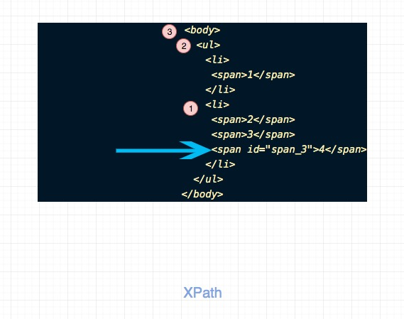

收集:
<a href="https://github.com/haizlin/fe-interview/blob/master/category/js.md" className="em">fe-interview</a>


### 大数相加

**题目描述**
如何实现两个非常大的数字(已经超出了Number范围)的加法运算。
注意由于这两个已经超过了Number范围，因此不能用Number存，这里我们选择使用字符串存储。

**思路**
我们只要将两个数字前面补0至相同的长度，然后从低位到高位进行相加，同时用一个变量记录进位的信息即可。

**参考代码**

```js
function bigNumberSum(a, b) {
  // 123456789
  // 000009876

  // padding
  let cur = 0;
  while (cur < a.length || cur < b.length) {
    if (!a[cur]) {
      a = "0" + a;
    } else if (!b[cur]) {
      b = "0" + b;
    }
    cur++;
  }

  let carried = 0;
  const res = [];

  for (let i = a.length - 1; i > -1; i--) {
    const sum = carried + +a[i] + +b[i];
    if (sum > 9) {
      carried = 1;
    } else {
      carried = 0;
    }
    res[i] = sum % 10;
  }
  if (carried === 1) {
    res.unshift(1);
  }

  return res.join("");
}
```


### 手写 bind

**题目描述**

写一个函数，实现Function.prototype.bind的功能。

**代码**

```js
Function.prototype.myBind = function(ctx, ...args) {
  return (...innerArgs) => this.call(ctx, ...args, ...innerArgs);
};

// test
const a = {
  name: "name of a"
};
function test(...msg) {
  console.log(this.name);
  console.log(...msg);
}
const t = test.myBind(a, "hello");
t("world");
```

### 实现加法

**题目描述**

实现两个数字相加的功能，要求不能使用编程语言现有的四则运算。

**代码**

```js
function twoSum(a, b) {
  if (a === 0) return b;
  if (b === 0) return a;
  const res = a ^ b;

  return twoSum(res, (a & b) << 1);
}

// test

a = twoSum("" + Math.pow(2, 20), "" + Math.pow(2, 20));

console.log(a === Math.pow(2, 21));
```

### 时分秒针在一天之类重合多少次？（24小时）

**题目描述**

如题

**代码**


### 实现 compose

**题目描述**

实现函数compose，compose接受多个函数作为参数，并返回一个新的函数，新的函数会从右向左依次执行原函数，
并且上一次结果的返回值将会作为下一个函数的参数。

> 因此compose函数有一个限制，就是被compose的函数是单元的，即只有一个参数，如果不这样的话，就只能返回数组了。
> 因为在JS中参数其实就是一个类数组。

**代码**

```js
function compose(...fns) {
  return (...args) => fns.reduceRight((acc, cur) => cur(acc), ...args);
}

function a(msg) {
  return msg + "a";
}
function b(msg) {
  return msg + "b";
}
function c(msg) {
  return msg + "c";
}

const f = compose(
  a,
  b,
  c
);
console.log(f("hello"));
```

### 实现 curry

**题目描述**

实现函数curry，该函数接受一个多元（多个参数）的函数作为参数，然后一个新的函数，这个函数
可以一次执行，也可以分多次执行。

eg:

```js
// test
function test(a, b, c) {
  console.log(a, b, c);
}

const f1 = curry(test)(1);
const f2 = f1(2);
f2(3);

```

curry的意义在于能够在不完全指定函数参数的情况下运行函数，实际意义呢？ 其实curry需要和compose等配合来有效果，比如
配合写出pointfree的代码。

**代码**

```js
function curry(fn) {
  const ctx = this;
  function inner(...args) {
    if (args.length === fn.length) return fn.call(ctx, ...args);
    return (...innerArgs) => inner.call(ctx, ...args, ...innerArgs);
  }

  return inner;
}

// test
function test(a, b, c) {
  console.log(a, b, c);
}

const f1 = curry(test)(1);
const f2 = f1(2);
f2(3);
```

### 剪枝叶

**题目描述**
有一条马路，马路上有很多树，树的高度不一。现在要统一剪树，剪到高度为 h。
意思就是，比 h 高的树都剪到 h，比 h 低的树高度不变。所有的树剪掉的总长度为 C。
现在要使 C>某个值的情况下(假设为 MM)，使 h 最大。问怎么确定 h。

**代码**

```js
function cutTree(list, MM, range) {
  if (list.length === 0) return 0;
  let start = 0;
  let end = Math.max(...list);

  while (start <= end) {
    const mid = start + ((end - start) >> 1);
    let res = 0;
    for (let i = 0; i < list.length; i++) {
      if (list[i] > mid) {
        res = res + list[i] - mid;
      }
    }
    if (res > MM) {
      if (res - MM <= range) return mid;
      end = mid - range;
    } else {
      start = mid + range;
    }
  }

  return -1;
}

// test
const a = cutTree([10, 8, 9, 7, 7, 6], 16, 1);
const b = cutTree([10, 8, 9, 7, 7, 6], 20, 1);
const c = cutTree([10, 8, 9, 7, 7, 6], 15, 1);

console.log(a, b, c);
```

### 循环有序列表的查找

**题目描述**

在一个循环有序的列表中查找指定的值。
比如`[6,7,8,1,2,3,4,5]`就是一个循环有序数组。


**代码**

```js
function find(nums, target) {
  // leetcode 原题 #33
  // 时间复杂度：O(logn)
  // 空间复杂度：O(1)
  // [6,7,8,1,2,3,4,5]
  let start = 0;
  let end = nums.length - 1;

  while (start <= end) {
    const mid = start + ((end - start) >> 1);
    if (nums[mid] === target) return mid;

    // [start, mid]有序

    // ️⚠️注意这里的等号
    if (nums[mid] >= nums[start]) {
      //target 在 [start, mid] 之间

      // 其实target不可能等于nums[mid]， 但是为了对称，我还是加上了等号
      if (target >= nums[start] && target <= nums[mid]) {
        end = mid - 1;
      } else {
        //target 不在 [start, mid] 之间
        start = mid + 1;
      }
    } else {
      // [mid, end]有序

      // target 在 [mid, end] 之间
      if (target >= nums[mid] && target <= nums[end]) {
        start = mid + 1;
      } else {
        // target 不在 [mid, end] 之间
        end = mid - 1;
      }
    }
  }

  return -1;
}
// test

const a = find([7, 7, 8, 9, 1, 2, 5, 6, 7, 7], 5);
const b = find([7, 7, 8, 9, 1, 2, 5, 6, 7, 7], 4);
const c = find([7, 7, 8, 9, 1, 2, 5, 6, 7, 7], 8);

console.log(a, b, c);
```

### 实现深拷贝


**代码**

```js
function deepCopy(o) {
  if (typeof o !== "object") return o;
  let n;
  if (Array.isArray(o)) {
    n = new Array(o.length);
    o.forEach((v,i) => (n[i] = deepCopy(v)));
  }

  // reg math function 等其他类型暂时不考虑
  else if (!Array.isArray(o)) {
    n = {};
    Object.keys(o).forEach(key => {
      n[key] = deepCopy(o[key]);
    });
  }

  return n;
}

const a = {
  a: [
    1,
    [4],
    {
      a: {
        c: [4]
      }
    }
  ]
}

const b = deepCopy(a);

a.c = "c";
console.log(a);
console.log(b);
console.log(a.c);
console.log(b.c);
```

### 实现继承

**代码**

```js
function extend(A, B) {
  function f() {}
  f.prototype = B.prototype;
  A.prototype = new f();
  A.prototype.constructor = A;
}

function A(name) {
  this.name = name;
}
function B(name) {
  this.name = name;
}
extend(A, B);
B.prototype.say = function() {
  console.log("b say");
};
A.prototype.eat = function() {
  console.log("a eat");
};

const a = new A("a name");

console.log(a.name);
a.say();
a.eat();
```

### 已知数据格式，实现一个函数 fn 找出链条中所有的父级 id

**题目描述**

```js
const list = [{
    id: '1',
    name: 'test1',
    children: [
        {
            id: '11',
            name: 'test11',
            children: [
                {
                    id: '111',
                    name: 'test111'
                },
                {
                    id: '112',
                    name: 'test112'
                }
            ]

        },
        {
            id: '12',
            name: 'test12',
            children: [
                {
                    id: '121',
                    name: 'test121'
                },
                {
                    id: '122',
                    name: 'test122'
                }
            ]
        }
    ]
}];
const id = '112'
const fn = (value) => {
...
}
fn(id, list) // 输出 [1， 11， 112]

```

**代码**

```js
function fn(id, list) {
  const match = list.find(item => item.id === id);
  if (match) return [id];
  const sub = list.find(item => id.startsWith(item.id));
  return [sub.id].concat(fn(id, sub.children));
}
```

### 拍平数组

**题目描述**
最新的ES规范其实也加入了这个方法，功能是将一个数组压平，比如`[1, 2, [3, [4, 5, [6, [7, 8]]]]]`,
会被处理成`[1, 2, 3, 4, 5, 6, 7, 8]`。
更进一步，实现可以压平指定深度的数组。

**代码**

```js
function flatten(list) {
  if (list.length === 0) return [];
  const head = list[0];
  if (head instanceof Array) {
    list[0] = flatten(head);
  } else {
    list[0] = [list[0]];
  }
  return list[0].concat(flatten(list.slice(1)));
}

function flattenDepth(list, n) {
  if (list.length === 0) return [];
  if (n === 0) return list;
  const head = list[0];
  if (head instanceof Array) {
    list[0] = flattenDepth(head, n - 1);
  } else {
    list[0] = [list[0]];
  }
  return list[0].concat(flattenDepth(list.slice(1), n));
}

// test

const a = flatten([1, 2, [3, [4, 5, [6, [7, 8]]]]]);

console.log(a);

const b = flattenDepth([1, 2, [3, [4, 5, [6, [7, 8]]]]], 2);

console.log(b);

const c = flattenDepth([1, 2, [3, [4, 5, [6, [7, 8]]]]], Number.MAX_VALUE);

console.log(c);
```

### 获取页面所有的 tagname

**题目描述**

获取当前页面中所有 HTML tag 的 名字，以数组形式输出, 重复的标签不重复输出。（不考虑 iframe 和 shadowDOM）

**关键点**

这道题的关键是两点：

1. 获取所有的 DOM

如果单纯从算法的角度来看，我们可以先获取到最外层的 HTML 元素，然后通过 children 递归即可。

事实上，我们可以借助一些 API 很简单完成这个功能，比如`window.document.querySelectorAll('*')`

2. 根据 tagName 去重

如果单纯从算法的角度来看，去重操作可以通过 Set 或者 HashMap 来做。从性能上来说，肯定是 Set，
因为 HashMap 存储的话实际上 value 没有用处。

或者我们可以使用快慢指针来做，具体可以看我之前解的一道题目[26.remove-duplicates-from-sorted-array](https://github.com/azl397985856/leetcode/blob/master/problems/26.remove-duplicates-from-sorted-array.md)

**代码**

```js
function getAllHTMLTags() {
  const tags = [...window.document.querySelectorAll("*")].map(
    dom => dom.tagName
  );
  return [...new Set(tags)];
}
```

**扩展**

将所有页面元素按照出现次数降序排序输出。

参考代码：

```js
function getAllHTMLTags() {
  const mapper = {};
  const tags = [...window.document.querySelectorAll("*")].map(
    dom => dom.tagName
  );
  for (let i = 0; i < tags.length; i++) {
      const tag = tags[i];
      if (mapper[tag] === void 0) {
          mapper[tag] = 1;
      }
      else mapper[tag] += 1;
  }

  return Object.entries(mapper).sort((a, b) => b[1] - a[1]).map(q => q[0]);
}
```

### 实现 getUrlParams

**题目描述**

给定一个url和一个key，查找key是否在url的查询字符串中，
如果在就返回，如果不在返回null，如果存在多个就返回数组。

**代码**

```js
// 给定key，求解href中的value，如果有多个，返回数组。如果没有返回null
function getUrlParams(key, href) {
  const query = href.split("?");
  if (query.length <= 1) return null;
  // a=1&b=2&a=3
  const pairs = query[1].split("&");
  const res = pairs
    .filter(pair => {
      const [k] = pair.split("=");
      if (k === key) return true;
      return false;
    })
    .map(pair => {
      const [, v] = pair.split("=");
      return v;
    });
  if (res.length === 0) return null;
  if (res.length === 1) return res[0];
  return res;
}

const a = getUrlParams("a", "http://lucifer.ren?a=1&b=2&a=3");
const b = getUrlParams("b", "http://lucifer.ren?a=1&b=2&a=3");
const c = getUrlParams("c", "http://lucifer.ren?a=1&b=2&a=3");

console.log(a);
console.log(b);
console.log(c);
```

### 用 reduce 实现 map


**代码**

```js
function implementMapUsingReduce(list, func) {
  return list.reduce((acc, cur, i) => {
    acc[i] = func(cur);
    return acc;
  }, []);
}

const a = implementMapUsingReduce([1, 2, 3, 4], a => a + 1); // [2,3,4,5]
console.log(a);

const b = implementMapUsingReduce(["a", "b", "c"], a => a + "!"); // ['a!', 'b!', 'c!']
console.log(b);
```

### 用栈实现队列


**代码**

```js
function queue(nums) {
  this.stack = nums || [];
  this.helperStack = [];
}

queue.prototype.push = function(ele) {
  // push
  // pop
  let cur = null;
  while ((cur = this.stack.pop())) {
    this.helperStack.push(cur);
  }
  this.helperStack.push(ele);

  while ((cur = this.helperStack.pop())) {
    this.stack.push(cur);
  }
};

queue.prototype.pop = function() {
  return this.stack.pop();
};

// test
const q = new queue();
q.push(1);
q.push(2);
q.push(3);
q.push(4);

console.log(q.stack);
console.log(q.helperStack);

q.push(5);

console.log(q.stack);
console.log(q.helperStack);

console.log(q.pop()); // 1
console.log(q.pop()); // 2
console.log(q.pop()); // 3
```

# 判断是否是完全二叉树

**代码**

```js
// 如何判断是不是完全二叉树
// leetcode 原题： https://leetcode.com/problems/check-completeness-of-a-binary-tree/
function isCompleteBinaryTree(root) {
  if (root === null) return root;
  let cur = root;
  const queue = [];

  while (cur !== null) {
    queue.push(cur.left);
    queue.push(cur.right);
    cur = queue.shift();
  }

  return queue.filter(Boolean).length === 0;
}
```

# 判断一个字符串是否另一个字符串的子序列

**题目描述**

这道题是leetcode基础题目。 问题是如何判断一个字符串是否另一个字符串的子序列，
比如给定 a = `apple`, b = `axpfxplle`; 那么a就是b的子序列。
你也可以这么理解，在b中删除零个或多个字符，如果可以使得a和b相等，那么说明a就是b的子序列。


**关键点**

典型的双指针题目。

**代码**

```js
// 判断a是否是b的子序列
function isSequence(a, b) {
    let i = 0;
    let j = 0;

    while(i < a.length && j < b.length) {
      if (a[i] === b[j]) i++;
      j++;
    }

    return i === a.length;
}

```

# 实现 lensProp

**题目描述**

给定一个字符串， 比如lensProp(a, obj) 返回 'obj.a'的值

**代码**

```js
//  
function lensProp(lens, obj) {
  const keys = lens.split(".");
  if (keys.lenngth < 1) return;
  return keys.reduce((acc, cur) => (acc !== void 0 ? acc[cur] : acc), obj);
}

const a = lensProp("a", { a: 1 }); // 1
const b = lensProp("b", { a: 1 }); // undefined
const c = lensProp("a.b", { a: { b: "c" } }); // c
const d = lensProp("a.b.c.d.e.f", { a: { b: "c" } }); // undefined

console.log(a);
console.log(b);
console.log(c);
console.log(d);
```

# 判断链表是否成环


**题目描述**

判断一个链表是否有环

**代码**

```js
// leetcode 原题： 141.linked-list-cycle
var hasCycle = function(head) {
  if (head === null) return false;
  if (head.next === null) return false;

  let fast = head.next;
  let slow = head;

  while (fast && fast.next) {
    if (fast === slow) return true;
    slow = slow.next;
    const next = fast.next;
    fast = next && next.next;
  }

  return false;
};
```

# 最长公共子序列

**代码**

```js
function longestCommonSequence(s1, s2) {
  const dp = [];

  for (let i = 0; i < s1.length + 1; i++) {
    dp[i] = Array(s2.length).fill(0);
  }
  for (let i = 1; i < s1.length + 1; i++) {
    for (let j = 1; j < s2.length + 1; j++) {
      if (s1[i - 1] === s2[j - 1]) {
        dp[i][j] = dp[i - 1][j - 1] + 1;
      } else {
        dp[i][j] = Math.max(dp[i][j - 1], dp[i - 1][j]);
      }
    }
  }
  return dp[s1.length][s2.length];
}

function expect(actual) {
  return {
    toBe(expected) {
      console.log(actual === expected, actual);
      return expected === actual;
    }
  };
}

expect(longestCommonSequence("fosh", "fish")).toBe("fsh".length);
expect(longestCommonSequence("fish", "hish")).toBe("ish".length);
expect(longestCommonSequence("lucider", "lucifer")).toBe("lucier".length);
expect(longestCommonSequence("hahaui", "hfui")).toBe("hui".length);
expect(longestCommonSequence("sasa", "fgdfrsa")).toBe("sa".length);
```

# 最长公共子串

**代码**

```js
function longestCommonSubstring(s1, s2) {
  const dp = [];
  let max = 0;

  for (let i = 0; i < s1.length + 1; i++) {
    dp[i] = Array(s2.length).fill(0);
  }
  for (let i = 1; i < s1.length + 1; i++) {
    for (let j = 1; j < s2.length + 1; j++) {
      if (s1[i - 1] === s2[j - 1]) {
        dp[i][j] = dp[i - 1][j - 1] + 1;
        max = Math.max(max, dp[i][j]);
      }
    }
  }

  return max;
}

function expect(actual) {
  return {
    toBe(expected) {
      console.log(actual === expected, actual);
      return expected === actual;
    }
  };
}

expect(longestCommonSubstring("hish", "fish")).toBe("ish".length);
expect(longestCommonSubstring("fish", "hish")).toBe("ish".length);
expect(longestCommonSubstring("lucider", "lucifer")).toBe("luci".length);
expect(longestCommonSubstring("sasa", "fgdfrsa")).toBe("sa".length);
expect(longestCommonSubstring("hulatang", "ata")).toBe("ata".length);
```

# 实现千分位展示

**代码**

```js
function moneyFormat(num) {
  // 123456789
  // 123,456,789
  const res = [];
  const decimalIndex = num.indexOf(".");
  const hasDecimal = decimalIndex > -1;

  for (let i = num.length - 1; i > -1; i--) {
    let cur = 1;
    while (hasDecimal && i >= decimalIndex) {
      res.unshift(num[i]);
      i--;
    }
    while (cur <= 3) {
      res.unshift(num[i]);
      cur++;
      i--;
    }
    res.unshift(num[i]);
    res.unshift(",");
  }

  if (res[0] === ",") res.shift();

  return res.join("");
}

function moneyFormatReg(num) {
  return num.replace(/(\d)(?=(\d{3})+(?!\d))/, $1 => $1 + ",");
}

console.log(moneyFormat("123456789"));
console.log(moneyFormat("1234567890"));

console.log(moneyFormat("123456789.0002"));
console.log(moneyFormat("1234567890.999"));

console.log(moneyFormatReg("123456789"));
console.log(moneyFormatReg("1234567890"));

console.log(moneyFormatReg("123456789.0002"));
console.log(moneyFormatReg("1234567890.999"));
```

# 实现一个极简的模板引擎

**题目描述**

实现函数 render, 是的返回符合预期。

```js
render("我是{{name}}，年龄{{age}}", {
  name: "lucifer",
  age: 17
});

// 结果： 我是姓名，年龄18
```

**关键点**

正则表示默认是`贪婪匹配`，如果实现懒惰匹配，在量词元字符后面添加一个`？`即可。

如果使用贪婪匹配，我们会匹配到最后一个}}，而不是第一个结束的}}。

**代码**

```js
function render(tpl, data) {
  return tpl.replace(/\{\{(.+?)\}\}/g, function($1, $2) {
    // $1 分组为 类似 {{name}}
    // $2 分组为 类似 name
    // 加上面的小括号就是为了方便拿到key而已
    return data[$2];
  });
}
```

# 无序不相等数组中，选取 N 个数，使其和为 M


**代码**

```js
function sum(list) {
  return list.reduce((acc, cur) => acc + cur, 0);
}
function backtrack(list, res, tempList, T, start) {
  // 如果不限定每个数字只能使用一次, 下面增加一行代码 if (tempList.length > list.length) return;
  if (sum(tempList) === T) return res.push([...tempList]);

  for (let i = start; i < list.length; i++) {
    tempList.push(list[i]);
    // 如果不限定每个数字只能使用一次, 下面代码改为backtrack(list, res, tempList, T, i);
    backtrack(list, res, tempList, T, i + 1);
    tempList.pop();
  }
}
// 从一个无序，不相等的数组中，选取N个数，使其和为M实现算法
function nSum(list, T) {
  const res = [];
  backtrack(list, res, [], T, 0);
  return res;
}

// test
const r = nSum([1, 3, 6, 4, 2, 7], 7);
console.log(r);
```

# 手动模拟new的执行过程


**代码**

```js
function myNew(constructor, ...args) {
  const obj = {};
  obj.__proto__ = constructor.prototype;
  const ret = constructor.call(obj, ...args);
  return ret instanceof Object ? ret : obj;
}
```

# 千分位转数字

**题目描述**

将千分位展示的字符串，转化为数字。 比如`1,231`，转化为`1231`.

**代码**

```js
function numFormat(str) {
  return str.replace(/,/g, '');
}

```

**扩展**

如果改为`¥1,231`，转化为`1231`. 支持各种货币呢？


很简单,换个思路即可。

```js
function numFormat(str) {
  return str.replace(/[^\d\.]/g, '');
}
```

# 将数字转化为中文(数字是 10 万以内)

**题目表述**

比如数字`12345`，我们转化为`一万二千三百四十五`。
比如数字`10002`，我们转化为`一万零二`。

**代码**

```js
function numToChinese(num) {
  const numStr = String(num);
  const numMapper = [
    "零",
    "一",
    "二",
    "三",
    "四",
    "五",
    "六",
    "七",
    "八",
    "九"
  ];

  const unitMapper = [, , "十", "百", "千", "万"];

  let res = "";

  for (let i = 0; i < numStr.length; i++) {
    const chNum =
      numStr[i] === "0" && res[res.length - 1] === "零"
        ? ""
        : numMapper[numStr[i]];
    const unit = numStr[i] === "0" ? "" : unitMapper[numStr.length - i] || "";
    res = res + chNum + unit;
  }

  return res[res.length - 1] === "零" ? res.slice(0, -1) : res;
}
```

# 实现一个极简的数据响应式

**题目描述**

```js
// 有一个全局变量 a，有一个全局函数 b，实现一个方法bindData，执行后，a中任何属性值修改都会触发b的执行。
const a = {
  b: 1
};
function b() {
  console.log("a的值发生改变");
}
bindData();
// 此时输出 a的值发生改变
a.b = 2; 

console.log(a.b);

```

**代码**

```js
function bindData() {
  Object.keys(a).map(key => {
    let v = a[key];
    Object.defineProperty(a, key, {
      get() {
        console.log('你正在读取a里面的值');
        return v;
      },
      set(newA) {
        v = newA;
        b();
      }
    });
  });
}
```

**思考**

其实从这个题目，你应该也能知道，Vue2中为什么你在data或者props中没有声明一个key的时候，
即使data或者props发生了变化，vue也不会更新。

# 计算素数的个数

**代码**


# 三个警察和三个囚徒的过河问题

**题目描述**

三个警察和三个囚徒共同旅行。一条河挡住了去路，河边有一条船，但是每次只能载2人。
存在如下的危险：无论在河的哪边，当囚徒人数多于警察的人数时，将有警察被囚徒杀死。
问题：请问如何确定渡河方案，才能保证6人安全无损的过河。

**参考答案**

```
第一次：两囚徒同过，回一囚徒
第二次：两囚徒同过，回一囚徒
第三次：两警察同过，回一囚徒一警察（此时对岸还剩下一囚徒一警察，是安全状态）
第四次：两警察同过，回一囚徒（此时对岸有3个警察，是安全状态）
第五次：两囚徒同过，回一囚徒
第六次：两囚徒同过；over
```

# 实现简化的 promise

**代码**

```js
function Promise(func) {
  this.fullfilled = false;
  this.rejected = false;
  this.pending = true;
  this.handlers = [];
  this.errorHandlers = [];
  function resolve(...args) {
    this.handlers.forEach(handler => handler(...args));
  }
  function reject(...args) {
    this.errorHandlers.forEach(handler => handler(...args));
  }
  func.call(this, resolve.bind(this), reject.bind(this));
}

Promise.prototype.then = function(func) {
  this.handlers.push(func);
  return this;
};
Promise.prototype.catch = function(func) {
  this.errorHandlers.push(func);
  return this;
};

Promise.race = promises =>
  new Promise((resolve, reject) => {
    promises.forEach(promise => {
      promise.then(resolve, reject);
    });
  });

Promise.all = promises =>
  new Promise((resolve, reject) => {
    let len = promises.length;
    let res = [];
    promises.forEach((p, i) => {
      p.then(r => {
        if (len === 1) {
          resolve(res);
        } else {
          res[i] = r;
        }
        len--;
      }, reject);
    });
  });

// test
const p1 = new Promise(resolve =>
  setTimeout(resolve.bind(null, "resolved"), 3000)
);
p1.then(console.log).then((...args) => console.log("second", ...args));

const p2 = new Promise((resolve, reject) =>
  setTimeout(reject.bind(null, "rejected"), 3000)
);
p2.then(console.log).catch((...args) => console.log("fail", ...args));
```

# 实现快排

**代码**

```js
function helper(list) {
  if (list.length <= 1) return list;
  // 空间复杂度 nlogn
  const bigger = [];
  const smaller = [];
  const pivotIndex = Math.floor(Math.random() * list.length);
  const pivot = list[pivotIndex];
  // 时间复杂度O(nlogn)
  for (let i = 0; i < list.length; i++) {
    const number = list[i];
    if (i === pivotIndex) continue;
    if (number >= pivot) {
      bigger.push(number);
    } else {
      smaller.push(number);
    }
  }
  return helper(smaller)
    .concat([pivot])
    .concat(helper(bigger));
}
function quickSort(list) {
  return helper(list);
}

// test

const l = quickSort([1, 3, 2, 9, 6, 5, 1, 0, -2, 10]);
console.log(l);
```

# 正则表达式编程题汇总

**传送们**

- [实现千分位展示](#实现千分位展示)
- [千分位转数字](#千分位转数字)

**其他题目**

1. 匹配URL中elective后的数字输出。

```
例1:

输入：
https://www.xx.cn/api?keyword=&level1=&local_batch_id=&elective=&local_province_id=33
输出： []

例2:
输入：
https://www.xx.cn/api?keyword=&level1=&local_batch_id=&elective=800&local_province_id=33
输出：['800']

例3:
输入：
https://www.xx.cn/api?keyword=&level1=&local_batch_id=&elective=800,700&local_province_id=33
输出：['800','700']
```

代码：

```js
const a =
  "https://www.xx.cn/api?keyword=&level1=&local_batch_id=&elective=&local_province_id=33";
const b =
  "https://www.xx.cn/api?keyword=&level1=&local_batch_id=&elective=800&local_province_id=33";
const c =
  "https://www.xx.cn/api?keyword=&level1=&local_batch_id=&elective=800,700&local_province_id=33";

[a, b, c].map(q => q.match(/(?<=elective=)(\d)+(,\d)*/));

```

# 周期执行某个函数 n 次

**代码**

```js
function repeat(func, times, ms, immediate) {
  let count = 0;
  const ctx = null;
  function inner(...args) {
    count++;
    if (count === 1 && immediate) {
      inner.call(ctx, ...args);
      func.call(ctx, ...args);
      return;
    }
    if (count > times) {
      return;
    }
    return setTimeout(() => {
      inner.call(ctx, ...args);
      func.call(ctx, ...args);
    }, ms);
  }
  return inner;
}
// const repeatFunc = repeat(console.log, 4, 3000);
// repeatFunc("hellworld"); //会打印4次 helloworld，每次间隔3秒

const repeatFunc = repeat(console.log, 4, 3000, true);
repeatFunc("hellworld"); //先立即打印一个hellworld，然后每个三秒打印三个hellworld
```

# 字符串反转

**代码**

```js
function reverseString(str) {
  if (str.length === 1) return str;

  return reverseString(str.slice(1)) + str[0];
}

console.log(reverseString("abc"));
console.log(reverseString("abca"));
console.log(reverseString("8cchds7"));
```

# 实现 Math.sqrt

**题目描述**

要求不用数学库，求 sqrt(2)精确到小数点后 10 位

**代码**

```js
function sqrt(num) {
  if (num < 0) return num;
  let start = 0;
  let end = num;
  let mid = num >> 1;
  const DIGIT_COUNT = 10;
  const PRECISION = Math.pow(0.1, DIGIT_COUNT);
  while (Math.abs(+(num - mid * mid).toFixed(DIGIT_COUNT)) > PRECISION) {
    mid = start + (end - start) / 2.0;
    if (mid * mid < num) {
      start = mid;
    } else {
      end = mid;
    }
  }

  return mid;
}

function sqrtNewton(n) {
  if (n <= 0) return n;

  let res;
  let last;
  const DIGIT_COUNT = 10;
  const PRECISION = Math.pow(0.1, DIGIT_COUNT);

  res = n;

  while (Math.abs(last - res) > PRECISION) {
    last = res;
    res = (res + n / res) / 2;
  }

  return res;
}
```

# 函数节流

**代码**

```js
function throttle(cb, ms) {
  let timer = null;
  const ctx = this;
  return (...args) => {
    clearTimeout(timer);
    timer = setTimeout(cb.bind(ctx, ...args), ms);
  };
}

// test

const t = throttle(console.log, 1000);

t("hello");
t("hello");
t("hello");

setTimeout(() => t("world"), 1100);

setTimeout(() => t("world"), 1200);
```

# 数据结构转换

**岗位信息**

- 公司：阿里 cbu
- 职级：P5
- 轮次：笔试题

**题目描述**

将形如： `[0, "a", 1, "b", 2, "c", 3, "e", 2, "d", 1, "x", 0, "ff"]` 的一个数组转化为如下的数据。

```js
{
  a: {
    b: {
      c: {
        e: null,
      },
      d: null,
    },
    x: null,
  },
  ff: null,
};
```

**前置知识**

- 暂无

**思路**

题目描述的不是很清晰。但通过观察发现应该是：

- 每两个一组。这两个中的第一个是深度，第二个是 key。
- 相同的深度不一定父节点相同。也就是说一个节点的父节点并不是深度-1 的节点，因为深度-1 的节点可能有多个。实际上一个节点的父节点应该是左侧离它最近的深度-1 的节点。

根据以上信息，我们可以使用递归来完成。
定义函数 dfs(A, start, d)，其中 A 为题目输入的数组，start 为当前遍历的索引，方便后续退出递归，d 则是一个用于存储深度信息的对象，形如：

```js
{
    -1: {
        ...
    },
    0: {
        ...
    },
    1: {
        ...
    },
    ...
}

```

其中 key 为深度，value 为深度所对应的对象。因此我们只需要返回 d[-1] 即可。
> -1 表示 0 层的父节点，你可以将其看成是一个虚拟节点， 其作用仅仅是简化逻辑判断。
有了上述信息，不难写出如下代码：

```js
function dfs(A, start, d) {
  if (start + 1 >= A.length) return;
  // do something
  dfs(A, start + 2, d);
}

function deserialization(A) {
  const d = {};
  dfs(A, 0, d);
  return d[-1];
}
```

接下来，我们只需要完成状态转移就好了。具体来说就是*将当前的 value 挂到父节点，并将当前节点更新到 d 中即可.*

**关键点**

- 理解题意

**代码**

```js
function dfs(A, start, d) {
  if (start + 1 >= A.length) return;
  const [depth, v] = [A[start], A[start + 1]];
  if (d[depth - 1] == void 0) {
    d[depth - 1] = {};
  }
  let next = {};
  if (
    start + 2 >= A.length ||
    (start + 2 < A.length && A[start + 2] < A[start])
  )
    next = null;
  d[depth - 1][v] = next;
  d[depth] = next;
  dfs(A, start + 2, d);
}

function deserialization(A) {
  const d = {};
  dfs(A, 0, d);
  return d[-1];
}

deserialization([0, "a", 1, "b", 2, "c", 3, "e", 2, "d", 1, "x", 0, "ff"]);
```

上面代码会输出：

```js
{
  a: {
    b: {
      c: {
        e: null,
      },
      d: null,
    },
    x: null,
  },
  ff: null,
};
```

# 数组去重

**代码**

```js
// 数组去重，要求时间复杂度O(nlogn) 空间复杂度O(1)
function uniqueArray(list) {
  // 1 1 2 2 3 4
  // 当然你可以自己写快排等nlogn的算法
  list.sort();
  // 剩下的代码和leetcode26题一摸一样

  const size = list.length;
  let slowP = 0;
  for (let fastP = 0; fastP < size; fastP++) {
    if (list[fastP] !== list[slowP]) {
      slowP++;
      list[slowP] = list[fastP];
    }
  }
  return list.slice(0, slowP + 1);
}

console.log(uniqueArray([1, 1, 2, 2, 3, 4]));
console.log(uniqueArray([1, 1, 6, 7, 9, 9, 8, 2, 2]));
console.log(uniqueArray(["a", "c", "b", "z", "A", "K", "d", "D", "a"]));
```

# 实现XPath

**题目描述**

实现一个函数，生成某个DOM元素的xpath，主要包含两部分：标签层级和兄弟元素中的顺序。

比如：

```
<body>
  <ul>
    <li>
      <span>1</span>
    </li>
    <li>
      <span>2</span>
      <span>3</span>
      <span id="span_3">4</span>
    </li>
  </ul>
</body>

```

如果传入id = "span_3" 的元素，那么生成的xpath是`body>ul[0]>li[1]>span[2]`

**思路**

我们的参数是目标节点，我们的目标是冒泡到body，然后记录中间的节点即可。

如图所示：



整个过程是：

- 我们通过target先找到了parentNode,即li。
- 我们通过li找到了parentNode,即ul。
- 我们通过ult找到了parentNode,即body。
- 结束


另外 DOM Node 数据结构大概是：

```js
{
  tagName: 'BODY',
  children: [
    {
      tagName: 'UL',
      children: [
        {
          tagName: 'LI',
          children: [{
            tagName: 'SPAN'
          }]
        }
      ]
    }
  ]
}

```

可以看出DOM Node是一种递归的数据结构，因此用递归来实现会非常直观和简洁。
如果不是特别严格的场景，通常也不会有严重性能问题。

**关键点**

- DFS
- 回溯
- parentNode 获取父节点， children 获取子节点


```js
function helper(node, path) {
  if (node === document.body) return `body ${path}`;

  const i = Array.prototype.findIndex.call(node.parentNode.children, el => el === node)
  return  helper(node.parentNode, `${path} > ${node.tagName.toLowerCase()}[${i}]`);
}

function XPath(node) {
  return helper(node, '');
}


```