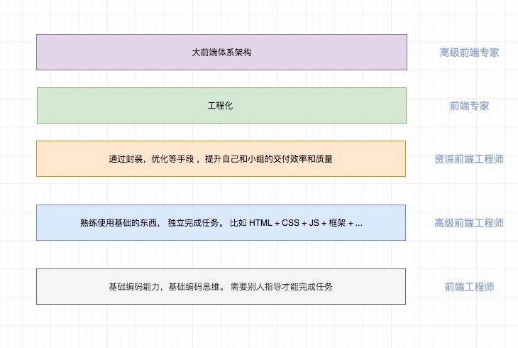

### 面试流程
首先第一个主题是面试的流程， 面试流程从时间先后的顺序可以划分为： 

- 网投/内推
- 线上评估
- 电话面试/视频面试
- 现场面试

这四个流程在一次面试中不一定都会有。

- 网投/内推  
网投指的是在网络上投递简历，这样选择面会很大。 内推指的是找内部人员推荐， 内推不仅有着快速地反馈流程，而且在有时候岗位刚刚空缺出来，岗位还没有 JD 的时候就可以内推。 因此建议大家尽量内推。


- 线上评估  
线上评估指的是在线做题，很多大公司以及外企都会设置这部分，尤其是对于应届生而言。   
这部分考察候选人的`基本算法能力，解题思路`


- 电话面试/视频面试  
这部分主要考察候选人的`算法能力，做题速度，沟通交流技巧`。


- 现场面试  
这部分主要考察候选人的`白板算法，系统设计，应变能力，价值观等`。


### 面试的考察点

#### 挂的原因

首先我们总结一下我们通常挂的原因有哪些？ 这里列举了几个常见的挂的点，希望大家可以引起共鸣。

1. 没有一遍 AC(accepted)
2. 没有 bug free
3. 直接碰到过的问题，不加思考，直接快速背答案。
   正确的做法应该是先复述，再做假设，再讲思路，然后给出一个稍微差一点的符合直觉的答案，最后慢慢优化给出最优解（或更优解）。
4. 思路混乱，不能给出优解，甚至暴力解法都不能很快给出
5. 忽略沟通，其实在解不出来的时候，面试官很多时候会给你些小提示的。
   即使你可以解决出来，也要注意沟通，不然会给人“不好沟通，埋头就是干”的感觉。因此一定要“沟通反馈”。
6. 代码不规范，体验不出工程性（封装，拆分），逻辑严密性。
7. 经常会说“我觉得xxx”，“应该是xxx”， “可能/好像/似乎xxx”等，这样不确定的话。
8. 面对质疑和反问，就害怕了，不敢发声，不敢反驳。

...

#### 考察点


通过以上这些问题，我们来总结一下面试中考察的点，这里总结了以下几点：

1. 分析问题，解决问题的能力

 - 抽象，定义问题的能力
 - 分治
 - 思维严密性

2. 沟通能力

 - 思路能否讲清楚
 - 是否能很好的和面试官沟通
 - 是否能够听懂面试官的要点信息

3. 代码能力

 - 防御式编程
 - 能否自我检查

4. 工程性，代码规范，编程思想

 - 命名/注释
 - 功能拆分

5. 好奇心，学习能力，尤其是自学能力

比如常见的问题，“你是如何学习前端的“， ”你碰到过的最困难的问题是什么？怎么解决的？“。

如果你平时会用技术去解决一些工作上的问题，或者有自己的博客和开源项目，那么可以很好的体验你的`好奇心强，学习能力强`。

对新技术保持敏感，关注社区也完全能够反应你的学习能力和对技术的热情。

> Tips: 面向Google 编程也是一个很重要的点，如果你只会百度，很有可能你效率低，可能会减分。

> Tips: 英文能力也能给自己加分

6. 执行能力，抗压能力

面对质疑，你的应对是怎么样的，是自信从容面对还是直接慌了开始怀疑自己。

面对一些很难完成或者无法完成的需求，我们怎么处理？是置之不理，说无法实现，还是
不断沟通，合理取舍。

7. 如果你是技术管理岗位，还会考察管理知识。

比如你需要知道”项目计划“，”项目跟踪和控制“，”风险管控“，”数据分析“，“机会成本分析”，”复盘总结“，
”人员管理（奖，惩，晋升，绩效等）“等等。

#### 小建议

另外给大家提个醒，对于电话面试/视频面试，以及现场面试，当面试官提出问题的时候，不要着急回答。
可以考虑从以下几个方面进行”重复“。

1. 原文复述
2. 明确面试官没有讲清楚的地方，有歧义的地方
3. 提出一些约束条件。 比如“我是否可以假设数字不大于 Int 最大值？我是否可以假设 xxx”

通过以上的步骤可以给面试官留下靠谱，善于沟通，思维严密的好印象。


### 面试应答话术和技巧

https://www.zhihu.com/question/35953016

---


### 岗位模型

即 Job Model.
Job Model 是 一个很重要的参考标准。 当然每个公司的 Job Model 都会不太一样， 大家可以根据自己心仪的公司的 Job Model 作为参考，自检一下.

比如我想要面试的是 P7 的岗位，那么 P7 的 Job Model 是什么呢？我可能需要提前了解一下。 一般来说 P7 的岗位要求会有：

- 基础扎实。计算机网络/设计模式/正则/安全等，并且要深入了解各项技术的原理和设计，而不只是使用。
- 经验丰富。熟悉业内不同技术方案以及优缺点，并且能选择最切合当前业务的方案。
- 技术驱动。探索新技术，将新技术带入团队，并赋能业务。
- 软技能。协同能力强，带领团队或者跨团队完成目标的能力。 ...

大家可以根据自己的期望层级，以及心仪公司的 Job Model 进行自测。  
我在这里画了一个简化版本的 Job Modal，大家可以根据自己的实际情况找自己的目标， 不同层级需要掌握的深度和广度是不一样的，大家根据自己的实际情况学习。

 


### 自我介绍

#### 自我介绍的内容

很多人回答这个问题，都只说姓名、年龄、爱好、工作经验，这些简历上已有的信息，这是不太好的。

其实，企业最希望知道的是求职者能否胜任工作，因此除了简历上已有的信息要准备几个亮点。

因此对于自我介绍我归纳为两个要点：

- 时间控制在1-3分钟

- 准备几个亮点，不要背简历里面有的东西

什么样的算是亮点呢？比如：

1. 自己的经历和优势。
2. 自己做过的项目中的难点，怎么思考和解决的。
3. 自己的重大业绩，突破性成果，包括工作和学习。
4. 对面试的公司的理解和认识，如果有独特的理解肯定会加分。
5. 比赛成绩，国内排名，开源项目。

等等，都可以作为亮点来讲。


补充说明一下， 其实比赛，国内排名等现在有很多线上比赛，几乎没有参与成本。
就leetcode来说，leetcode会有周赛，如果你取得不错的成绩，甚至获得了不错的
排名都是可以拿出来说的。

#### 自我介绍的格式

上面是对内容上的总结，除了保证内容，还要注意表述方法，不然会让面试官云里雾里，
甚至会给你贴上"沟通能力差的"标签。 因此切记回答要有条理，分清主次，不要直接切入技术，而是要先交代背景信息。

比如， 由于xxxxx，我们公司决定xxxx， 开始的时候xxxx，然后经过xxxxx，取得了xxxxx。 这样的一个格式就很清晰。

或者:

```
首先xxx其次xxx最后
第一xxx第二xxx第三
```


另外要注意的是眼神要留在面试官身上，最好是脸部（电话面试除外😄）。


### 提问环节

通常面试结束，面试官会问你有没有问题，那么我们应该问什么呢？

- 可以问本职岗位工作要求、职责。
- 可以问公司、公司的业务、体系、行业、客户。
- 可以问什么时候面试结果通知。
- 切忌纠缠薪资待遇。
- 如果你对公司所在行业以及业务能够提出一些好的问题也会加分

---