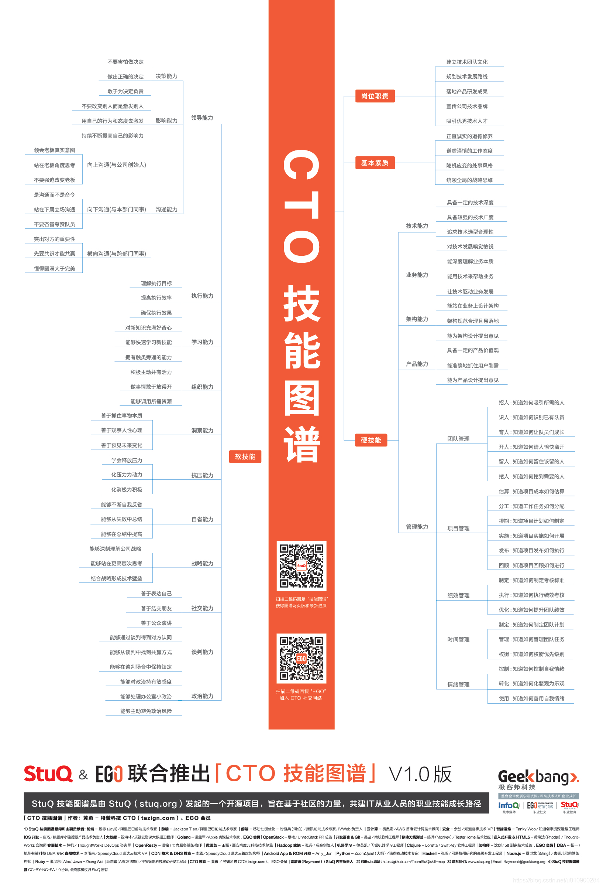

# JS思维导图汇总
-----------------------------

## 1.JavaScript变量

## 2.JavaScript运算符

## 3.JavaScript数组

## 4.JavaScript流程语句

## 5.JavaScript字符串函数

## 6.JavaScript函数基础

## 7.JavaScript基础DOM操作

## 8.JavaScript基础BOM操作

## 9.JavaScript正则表达式

