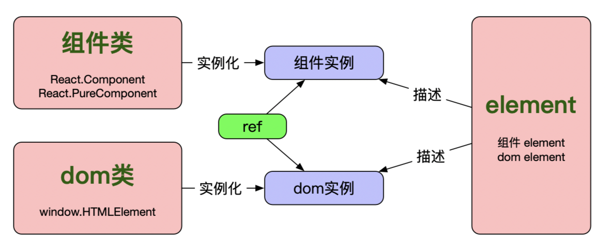
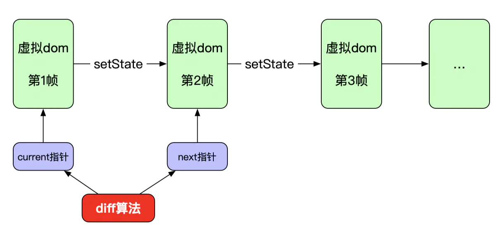
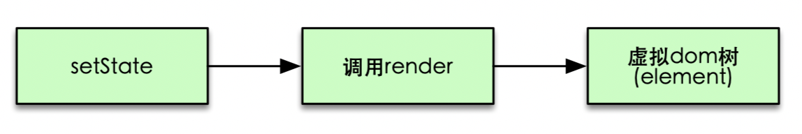
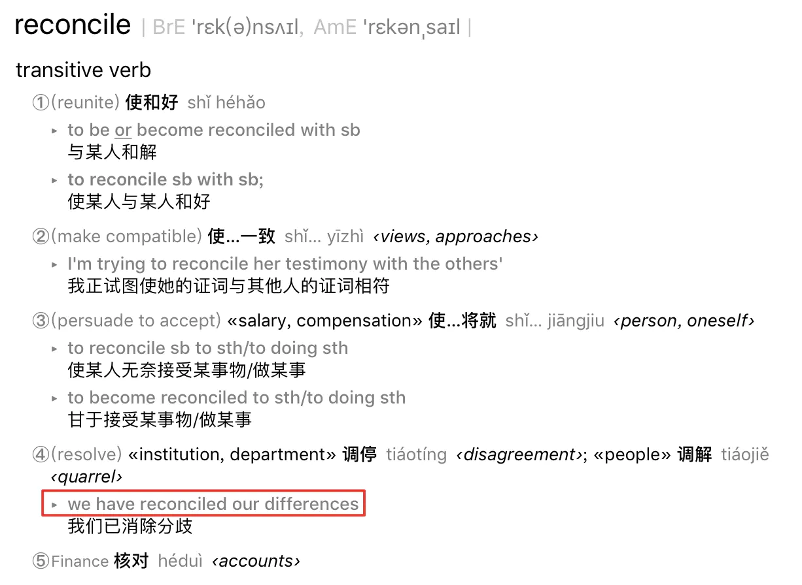
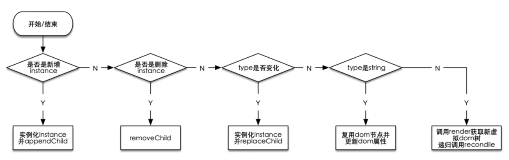

react在前端开发领域已经越来越🔥了，我自己也经常在项目中使用react，但是却总是好奇react的底层实现原理，多次尝试阅读react源代码都无法读下去，确实太难了。前不久在网上看到几篇介绍如何自己动手实现react的文章，这里基于这些资料，并加入一些自己的想法，从0开始仅用200行代码实现一个简版react，相信看完后大家都会对react的内部实现原理有更多了解。但是在动手之前我们需要先掌握几个react相关的重要概念，比如组件(类)与组件实例的区别、diff算法以及生命周期等，下面依次介绍下，熟悉完这些概念我们再动手实现。  

## 1 基本概念：

`Component(组件)`、`instance(组件实例)`、 `element`、`jsx`、`dom`  

首先我们需要弄明白几个容易混淆的概念，最开始学习react的时候我也有些疑惑他们之间有什么不同，前几天跟一个新同学讨论一个问题，发现他竟然也分不清组件和组件实例，因此很有必要弄明白这几个概念的区别于联系，本篇后面我们实现这个简版react也是基于这些概念。  

### Component（组件）
Component就是我们经常实现的组件，可以是类组件（`class component`）或者函数式组件（`functional component`），而类组件又可以分为普通类组件(`React.Component`)以及纯类组件（`React.PureComponent`），总之这两类都属于类组件，只不过`PureComponent`基于`shouldComponentUpdate`做了一些优化，这里不展开说。函数式组件则用来简化一些简单组件的实现，用起来就是写一个函数，入参是组件属性`props`，出参与类组件的`render`方法返回值一样，是`react element`（注意这里已经出现了接下来要介绍的`element`哦）。  

下面我们分别按三种方式实现下Welcome组件：  

```jsx
// Component
class Welcome extends React.Component {
    render() {
        return <h1>Hello, {this.props.name}</h1>;
    }
}
// PureComponent
class Welcome extends React.PureComponent {
    render() {
        return <h1>Hello, {this.props.name}</h1>;
    }
}
// functional component
function Welcome(props) {
    return <h1>Hello, {props.name}</h1>;
}
```
### instance（组件实例）  

熟悉面向对象编程的人肯定知道类和实例的关系，这里也是一样的，组件实例其实就是一个组件类实例化的结果，概念虽然简单，但是在react这里却容易弄不明白，为什么这么说呢？因为大家在react的使用过程中并不会自己去实例化一个组件实例，这个过程其实是react内部帮我们完成的，因此我们真正接触组件实例的机会并不多。我们更多接触到的是下面要介绍的element，因为我们通常写的jsx其实就是element的一种表示方式而已(后面详细介绍)。虽然组件实例用的不多，但是偶尔也会用到，其实就是ref。ref可以指向一个dom节点或者一个类组件(class component)的实例，但是不能用于函数式组件，因为函数式组件不能实例化。这里简单介绍下ref，我们只需要知道ref可以指向一个组件实例即可，更加详细的介绍大家可以看react官方文档Refs and the DOM。  

### element  

前面已经提到了element，即类组件的render方法以及函数式组件的返回值均为element。那么这里的element到底是什么呢？其实很简单，就是一个纯对象（`plain object`），而且这个纯对象包含两个属性：`type:(string|ReactClass)`和`props:Object`，注意`element`并不是组件实例，而是一个纯对象。虽然`element`不是组件实例，但是又跟组件实例有关系，`element`是对组件实例或者`dom`节点的描述。如果type是`string`类型，则表示dom节点，如果type是`function`或者`class`类型，则表示组件实例。比如下面两个element分别描述了一个dom节点和一个组件实例：

```jsx
// 描述dom节点
{
  type: 'button',
  props: {
    className: 'button button-blue',
    children: {
      type: 'b',
      props: {
        children: 'OK!'
      }
    }
  }
}
function Button(props){
  // ...
}

// 描述组件实例
{
  type: Button,
  props: {
    color: 'blue',
    children: 'OK!'
  }
}
```
### jsx  
只要弄明白了element，那么jsx就不难理解了，jsx只是换了一种写法，方便我们来创建`element`而已，想想如果没有jsx那么我们开发效率肯定会大幅降低，而且代码肯定非常不利于维护。比如我们看下面这个jsx的例子：  

`const foo = <div id="foo">Hello!</div>;`

其实说白了就是定义了一个dom节点div，并且该节点的属性集合是`{id: 'foo'}`，children是Hello!，就这点信息量而已，因此完全跟下面这种纯对象的表示是等价的：

```jsx
{
  type: 'div',
  props: {
    id: 'foo',
    children: 'Hello!'
  }
}
```

那么React是如何将jsx语法转换为纯对象的呢？其实就是利用Babel编译生成的，我们只要在使用jsx的代码里加上个编译指示(pragma)即可，可以参考这里Babel如何编译jsx。
比如我们将编译指示设置为指向createElement函数：/** @jsx createElement */，那么前面那段jsx代码就会编译为：
```jsx
var foo = createElement('div', {id:"foo"}, 'Hello!');
```

可以看出，jsx的编译过程其实就是从<、>这种标签式写法到函数调用式写法的一种转化而已。有了这个前提，我们只需要简单实现下createElement函数不就可以构造出element了嘛，我们后面自己实现简版react也会用到这个函数：  

```jsx
function createElement(type, props, ...children) {
    props = Object.assign({}, props);
    props.children = [].concat(...children)
      .filter(child => child != null && child !== false)
      .map(child => child instanceof Object ? child : createTextElement(child));
    return {type, props};
}
```

### dom  
dom我们这里也简单介绍下，作为一个前端研发人员，想必大家对这个概念应该再熟悉不过了。我们可以这样创建一个dom节点div：

```jsx
const divDomNode = window.document.createElement('div');
```

其实所有dom节点都是HTMLElement类的实例，我们可以验证下：

```jsx
window.document.createElement('div') instanceof window.HTMLElement;

// 输出 true
```

关于HTMLElementAPI可以参考这里：HTMLElement介绍。因此，dom节点是HTMLElement类的实例；同样的，在react里面，组件实例是组件类的实例，而element又是对组件实例和dom节点的描述，现在这些概念之间的关系大家应该都清楚了吧。介绍完了这几个基本概念，我们画个图来描述下这几个概念之间的关系：


## 2 虚拟dom与diff算法

相信使用过react的同学都多少了解过这两个概念：虚拟dom以及diff算法。这里的虚拟dom其实就是前面介绍的element，为什么说是虚拟dom呢，前面咱们已经介绍过了，element只是dom节点或者组件实例的一种纯对象描述而已，并不是真正的dom节点，因此是虚拟dom。react给我们提供了声明式的组件写法，当组件的props或者state变化时组件自动更新。整个页面其实可以对应到一棵dom节点树，每次组件props或者state变更首先会反映到虚拟dom树，然后最终反应到页面dom节点树的渲染。
那么虚拟dom跟diff算法又有什么关系呢？之所以有diff算法其实是为了提升渲染效率，试想下，如果每次组件的state或者props变化后都把所有相关dom节点删掉再重新创建，那效率肯定非常低，所以在react内部存在两棵虚拟dom树，分别表示现状以及下一个状态，setState调用后就会触发diff算法的执行，而好的diff算法肯定是尽可能复用已有的dom节点，避免重新创建的开销。我用下图来表示虚拟dom和diff算法的关系：



react组件最初渲染到页面后先生成第1帧虚拟dom，这时current指针指向该第一帧。setState调用后会生成第2帧虚拟dom，这时next指针指向第二帧，接下来diff算法通过比较第2帧和第1帧的异同来将更新应用到真正的dom树以完成页面更新。
这里再次强调一下setState后具体怎么生成虚拟dom，因为这点很重要，而且容易忽略。前面刚刚已经介绍过什么是虚拟dom了，就是element树而已。那element树是怎么来的呢？其实就是render方法返回的嘛，下面的流程图再加深下印象：



其实react官方对diff算法有另外一个称呼，大家肯定会在react相关资料中看到，叫Reconciliation，我个人认为这个词有点晦涩难懂，不过后来又重新翻看了下词典，发现跟diff算法一个意思：


可以看到reconcile有消除分歧、核对的意思，在react语境下就是对比虚拟dom异同的意思，其实就是说的diff算法。这里强调下，我们后面实现部实现reconcile函数，就是实现diff算法。

## 3 生命周期与diff算法

生命周期与diff算法又有什么关系呢？这里我们以componentDidMount、componentWillUnmount、ComponentWillUpdate以及componentDidUpdate为例说明下二者的关系。我们知道，setState调用后会接着调用render生成新的虚拟dom树，而这个虚拟dom树与上一帧可能会产生如下区别：

新增了某个组件；
删除了某个组件；
更新了某个组件的部分属性。

因此，我们在实现diff算法的过程会在相应的时间节点调用这些生命周期函数。
这里需要重点说明下前面提到的第1帧，我们知道每个react应用的入口都是：
https://juejin.cn/post/6844903733998911501
```jsx
ReactDOM.render(
    <h1>Hello, world!</h1>,
    document.getElementById('root')
);
```
`ReactDom.render`也会生成一棵虚拟dom树，但是这棵虚拟dom树是开天辟地生成的第一帧，没有前一帧用来做diff，因此这棵虚拟dom树对应的所有组件都只会调用挂载期的生命周期函数，比如`componentDidMount`、`componentWillUnmount`。

## 4 实现
掌握了前面介绍的这些概念，实现一个简版react也就不难了。这里需要说明下，本节实现部分是基于这篇博客的实现Didact: a DIY guide to build your own React。
现在首先看一下我们要实现哪些API，我们最终会以如下方式使用：
```jsx
// 声明编译指示
/** @jsx DiyReact.createElement */

// 导入我们下面要实现的API
const DiyReact = importFromBelow();

// 业务代码
const randomLikes = () => Math.ceil(Math.random() * 100);
const stories = [
  {name: "React", url: "https://reactjs.org/", likes: randomLikes()},
  {name: "Node", url: "https://nodejs.org/en/", likes: randomLikes()},
  {name: "Webpack", url: "https://webpack.js.org/", likes: randomLikes()}
];

const ItemRender = props => {
  const {name, url} = props;
  return (
    <a href={url}>{name}</a>
  );
};

class App extends DiyReact.Component {
    render() {
        return (
            <div>
                <h1>DiyReact Stories</h1>
                <ul>
                    {this.props.stories.map(story => {
                        return <Story name={story.name} url={story.url} />;
                    })}
                </ul>
            </div>
        );
    }
    
    componentWillMount() {
        console.log('execute componentWillMount');
    }
    
    componentDidMount() {
        console.log('execute componentDidMount');
    }
    
    componentWillUnmount() {
        console.log('execute componentWillUnmount');
    }
}

class Story extends DiyReact.Component {
    constructor(props) {
        super(props);
        this.state = {likes: Math.ceil(Math.random() * 100)};
    }
    like() {
        this.setState({
            likes: this.state.likes + 1
        });
    }
    render() {
        const {name, url} = this.props;
        const {likes} = this.state;
        const likesElement = <span />;
        return (
            <li>
                <button onClick={e => this.like()}>{likes}<b>❤️</b></button>
                <ItemRender {...itemRenderProps} />
            </li>
        );
    }
    
    // shouldcomponentUpdate() {
    //   return true;
    // }
    
    componentWillUpdate() {
        console.log('execute componentWillUpdate');
    }
    
    componentDidUpdate() {
        console.log('execute componentDidUpdate');
    }
}

// 将组件渲染到根dom节点

DiyReact.render(<App stories={stories} />, document.getElementById("root"));
```

我们在这段业务代码里面使用了render、createElement以及Component三个API，因此后面的任务就是实现这三个API并包装到一个函数importFromBelow内即可。

#### 4.1 实现createElement
createElement函数的功能跟jsx是紧密相关的，前面介绍jsx的部分已经介绍过了，其实就是把类似html的标签式写法转化为纯对象element，具体实现如下：

```jsx
function createElement(type, props, ...children) {
    props = Object.assign({}, props);
    props.children = [].concat(...children)
        .filter(child => child != null && child !== false)
        .map(child => child instanceof Object ? child : createTextElement(child));
    return {type, props};
}
```

#### 4.2 实现render  
注意这个render相当于ReactDOM.render，不是组件的render方法，组件的render方法在后面Component实现部分。

```jsx
// rootInstance用来缓存一帧虚拟dom
let rootInstance = null;
function render(element, parentDom) {
    // prevInstance指向前一帧
    const prevInstance = rootInstance;
    // element参数指向新生成的虚拟dom树
    const nextInstance = reconcile(parentDom, prevInstance, element);
    // 调用完reconcile算法(即diff算法)后将rooInstance指向最新一帧
    rootInstance = nextInstance;
}
```

render函数实现很简单，只是进行了两帧虚拟dom的对比(reconcile)，然后将rootInstance指向新的虚拟dom。细心点会发现，新的虚拟dom为element，即最开始介绍的element，而reconcile后的虚拟dom是instance，不过这个instance并不是组件实例，这点看后面instantiate的实现。总之render方法其实就是调用了reconcile方法进行了两帧虚拟dom的对比而已。

#### 4.3 实现instantiate  

那么前面的instance到底跟element有什么不同呢？其实instance指示简单的是把element重新包了一层，并把对应的dom也给包了进来，这也不难理解，毕竟我们调用reconcile进行diff比较的时候需要把跟新应用到真实的dom上，因此需要跟dom关联起来，下面实现的instantiate函数就干这个事的。注意由于element包括dom类型和Component类型(由type字段判断，不明白的话可以回过头看一下第一节的element相关介绍)，因此需要分情况处理：
dom类型的element.type为string类型，对应的instance结构为{element, dom, childInstances}。
Component类型的element.type为ReactClass类型，对应的instance结构为{dom, element, childInstance, publicInstance}，注意这里的publicInstance就是前面介绍的组件实例。

```jsx
function instantiate(element) {
    const {type, props = {}} = element;
    const isDomElement = typeof type === 'string';
    
    if (isDomElement) {
        // 创建dom
        const isTextElement = type === TEXT_ELEMENT;
        const dom = isTextElement ? document.createTextNode('') : document.createElement(type);
        
        // 设置dom的事件、数据属性
        updateDomProperties(dom, [], element.props);
        const children = props.children || [];
        const childInstances = children.map(instantiate);
        const childDoms = childInstances.map(childInstance => childInstance.dom);
        childDoms.forEach(childDom => dom.appendChild(childDom));
        const instance = {element, dom, childInstances};
        return instance;
    } else {
        const instance = {};
        const publicInstance = createPublicInstance(element, instance);
        const childElement = publicInstance.render();
        const childInstance = instantiate(childElement);
        Object.assign(instance, {dom: childInstance.dom, element, childInstance, publicInstance});
        return instance;
    }
}
```
需要注意，由于dom节点和组件实例都可能有孩子节点，因此instantiate函数中有递归实例化的逻辑。

#### 4.4 区分类组件与函数式组件

前面我们提到过，组件包括类组件（`class component`）与函数式组件（`functional component`）。我在平时的业务中经常用到这两类组件，如果一个组件仅用来渲染，我一般会使用函数式组件，毕竟代码逻辑简单清晰易懂。那么React内部是如何区分出来这两种组件的呢？这个问题说简单也简单，说复杂也复杂。为什么这么说呢，是因为React内部实现方式确实比较简单，但是这种简单的实现方式却是经过各种考量后确定下来的实现方式。蛋总(Dan)有一篇文章详细分析了下React内部如何区分二者，强烈推荐大家阅读，这里我直接拿过来用，文章链接见这里How Does React Tell a Class from a Function?。其实很简答，我们实现类组件肯定需要继承自类`React.Component`，因此首先给`React.Component`打个标记，然后在实例化组件时判断element.type的原型链上是否有该标记即可。

```jsx
// 打标记
Component.prototype.isReactComponent = {};

// 区分组件类型
const type = element.type;
const isDomElement = typeof type === 'string';
const isClassElement = !!(type.prototype && type.prototype.isReactComponent);
```

这里我们升级下前面的实例化函数instantiate以区分出函数式组件与类组件：

```jsx
function instantiate(element) {
    const {type, props = {}} = element;
    const isDomElement = typeof type === 'string';
    const isClassElement = !!(type.prototype && type.prototype.isReactComponent);
    if (isDomElement) {
      // 创建dom
      const isTextElement = type === TEXT_ELEMENT;
      const dom = isTextElement ? document.createTextNode('') : document.createElement(type);
      
      // 设置dom的事件、数据属性
      updateDomProperties(dom, [], element.props);
      const children = props.children || [];
      const childInstances = children.map(instantiate);
      const childDoms = childInstances.map(childInstance => childInstance.dom);
      childDoms.forEach(childDom => dom.appendChild(childDom));
      const instance = {element, dom, childInstances};
      return instance;
    } else if (isClassElement) {
      const instance = {};
      const publicInstance = createPublicInstance(element, instance);
      const childElement = publicInstance.render();
      const childInstance = instantiate(childElement);
      Object.assign(instance, {dom: childInstance.dom, element, childInstance, publicInstance});
      return instance;
    } else {
      const childElement = type(element.props);
      const childInstance = instantiate(childElement);
      const instance = {
        dom: childInstance.dom,
        element,
        childInstance,
        fn: type
      };
      return instance;
    }
  }
 ```

可以看到，如果是函数式组件，我们没有实例化该组件，而是直接调用了该函数获取虚拟dom。

#### 4.5 实现reconcile(diff算法)  
重点来了，reconcile是react的核心，显然如何将新设置的state快速的渲染出来非常重要，因此react会尽量复用已有节点，而不是每次都动态创建所有相关节点。但是react强大的地方还不仅限于此，react16将reconcile算法由之前的stack架构升级成了fiber架构，更近一步做的性能优化。fiber相关的内容下一节再介绍，这里为了简单易懂，仍然使用类似stack架构的算法来实现，对于fiber现在只需要知道其调度原理即可，当然后面有时间可以再实现一版基于fiber架构的。
首先看一下整个reconcile算法的处理流程：

可以看到，我们会根据不同的情况做不同的处理：

如果是新增instance，那么需要实例化一个instance并且appendChild；
如果是不是新增instance，而是删除instance，那么需要removeChild；
如果既不是新增也不是删除instance，那么需要看instance的type是否变化，如果有变化，那节点就无法复用了，也需要实例化instance，然后replaceChild；
如果type没变化就可以复用已有节点了，这种情况下要判断是原生dom节点还是我们自定义实现的react节点，两种情况下处理方式不同。

大流程了解后，我们只需要在对的时间点执行生命周期函数即可，下面看具体实现：

```jsx
function reconcile(parentDom, instance, element) {
    if (instance === null) {
        const newInstance = instantiate(element);
        // componentWillMount
        newInstance.publicInstance
            && newInstance.publicInstance.componentWillMount
            && newInstance.publicInstance.componentWillMount();
        parentDom.appendChild(newInstance.dom);
        // componentDidMount
        newInstance.publicInstance
            && newInstance.publicInstance.componentDidMount
            && newInstance.publicInstance.componentDidMount();
        return newInstance;
    } else if (element === null) {
        // componentWillUnmount
        instance.publicInstance
            && instance.publicInstance.componentWillUnmount
            && instance.publicInstance.componentWillUnmount();
        parentDom.removeChild(instance.dom);
        return null;
    } else if (instance.element.type !== element.type) {
        const newInstance = instantiate(element);
        // componentDidMount
        newInstance.publicInstance
            && newInstance.publicInstance.componentDidMount
            && newInstance.publicInstance.componentDidMount();
        parentDom.replaceChild(newInstance.dom, instance.dom);
        return newInstance;
    } else if (typeof element.type === 'string') {
        updateDomProperties(instance.dom, instance.element.props, element.props);
        instance.childInstances = reconcileChildren(instance, element);
        instance.element = element;
        return instance;
    } else {
        if (instance.publicInstance
            && instance.publicInstance.shouldcomponentUpdate) {
            if (!instance.publicInstance.shouldcomponentUpdate()) {
                return;
            }
        }
        // componentWillUpdate
        instance.publicInstance
            && instance.publicInstance.componentWillUpdate
            && instance.publicInstance.componentWillUpdate();
        instance.publicInstance.props = element.props;
        let newChildElement;
        if (instance.publicInstance) { // 类组件
            instance.publicInstance.props = element.props;
            newChildElement = instance.publicInstance.render();
        } else { // 函数式组件
            newChildElement = instance.fn(element.props);
        }
        const oldChildInstance = instance.childInstance;
        const newChildInstance = reconcile(parentDom, oldChildInstance, newChildElement);
        // componentDidUpdate
        instance.publicInstance
            && instance.publicInstance.componentDidUpdate
            && instance.publicInstance.componentDidUpdate();
        instance.dom = newChildInstance.dom;
        instance.childInstance = newChildInstance;
        instance.element = element;
        return instance;
    }
}

function reconcileChildren(instance, element) {
    const {dom, childInstances} = instance;
    const newChildElements = element.props.children || [];
    const count = Math.max(childInstances.length, newChildElements.length);
    const newChildInstances = [];
    for (let i = 0; i < count; i++) {
        newChildInstances[i] = reconcile(dom, childInstances[i], newChildElements[i]);
    }
    return newChildInstances.filter(instance => instance !== null);
}
```
看完reconcile算法后肯定有人会好奇，为什么这种算法叫做stack算法，这里简单解释一下。从前面的实现可以看到，每次组件的state更新都会触发reconcile的执行，而reconcile的执行也是一个递归过程，而且一开始直到递归执行完所有节点才停止，因此称为stack算法。由于是个递归过程，因此该diff算法一旦开始就必须执行完，因此可能会阻塞线程，又由于js是单线程的，因此这时就可能会影响用户的输入或者ui的渲染帧频，降低用户体验。不过react16中升级为了fiber架构，这一问题得到了解决。

#### 4.6 整体代码

把前面实现的所有这些代码组合起来就是完整的简版react，不到200行代码，so easy～！完整代码见DiyReact。

### 5 fiber架构

react16升级了reconcile算法架构，从stack升级为fiber架构，前面我们已经提到过stack架构的缺点，那就是使用递归实现，一旦开始就无法暂停，只能一口气执行完毕，由于js是单线程的，这就有可能阻塞用户输入或者ui渲染，会降低用户体验。
而fiber架构则不一样。底层是基于requestIdleCallback来调度diff算法的执行，关于requestIdleCallback的介绍可以参考我之前写的一篇关于js事件循环的文章javascript事件循环（浏览器端、node端）。requestIdlecallback的特点顾名思义就是利用空闲时间来完成任务。注意这里的空闲时间就是相对于那些优先级更高的任务(比如用户输入、ui渲染)来说的。
这里再简单介绍一下fiber这个名称的由来，因为我一开始就很好奇为什么叫做fiber。fiber其实是纤程的意思，并不是一个新词汇，大家可以看维基百科的解释Fiber (computer science)。其实就是想表达一种更加精细粒度的调度的意思，因为基于这种算法react可以随时暂停diff算法的执行，而后有空闲时间了接着执行，这是一种更加精细的调度算法，因此称为fiber架构。本篇对fiber就先简单介绍这些，后面有时间再单独总结一篇。

### 6 参考资料
主要参考以下资料：

- React Components, Elements, and Instances
- Refs and the DOM
- HTMLElement介绍
- Didact: a DIY guide to build your own React
- How Does React Tell a Class from a Function?
- Lin Clark - A Cartoon Intro to Fiber - React Conf 2017
- Let’s fall in love with React Fiber


转自 https://juejin.cn/post/6844903733998911501